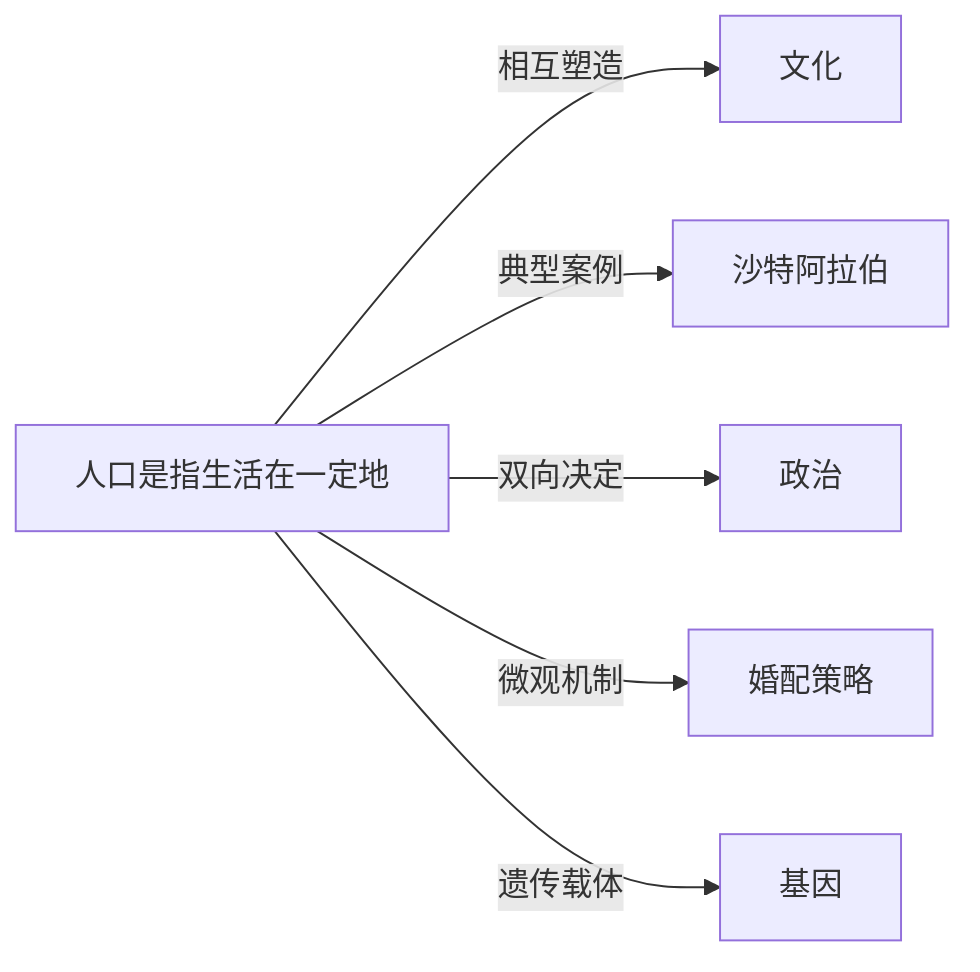

# 人口

## 定义
人口是指生活在一定地域和时间范围内的个人的总和，通常以数量、结构和变动为基本维度。

## 核心解释
人口的核心内涵不仅是人数的集合，还包括年龄、性别、教育、就业等结构特征，以及出生、死亡、迁移等动态过程。它的边界既可以是全球、国家，也可以是城市或社区。常见误解是将人口简单等同于人口数量，忽视了结构（如老龄化）和素质（如健康与教育）对社会的深层影响。

## 示例
- 第七次全国人口普查显示，中国60岁及以上人口占比超过18%，进入中度老龄化社会。
- 沙特阿拉伯的外籍劳工占常住人口的三分之一以上，深刻影响了其经济与社会结构。

## 关联概念
- [[文化]]：人口规模、密度与多样性催生特定文化形态，而宗教、生育观念等文化因素又直接作用于生育率与人口行为。
- [[沙特阿拉伯]]：作为高外籍人口比例和年轻年龄结构国家的代表，其人口构成对政治稳定、福利制度和劳动力市场产生了特殊影响。
- [[政治]]：人口的数量与分布决定选区划分和权力格局，政治决策（如移民政策、生育补贴）则又塑造人口的规模与结构。
- [[婚配策略]]：婚配年龄、普遍程度和配偶选择模式直接影响初婚初育时间、生育子女数和家庭户结构，从而宏观上改变人口再生产。
- [[基因]]：人口是基因库的承载体，人口迁移、隔离和混合改变基因流动，而人口规模波动则影响遗传漂变和自然选择的强度。

## 相关问题
- 人口红利如何在结构性变化后转变为人口负债？
- 低生育率和老龄化对社会保障体系有哪些冲击？

## 关系图

