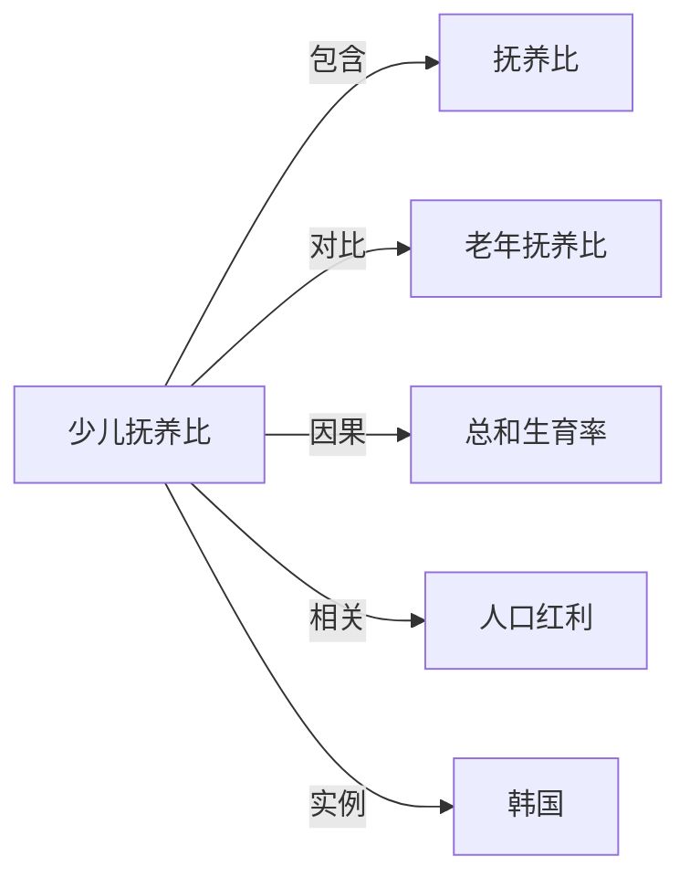

# 少儿抚养比

## 定义
0—14 岁人口与劳动年龄人口（通常指 15—64 岁）之比，衡量一个社会抚养未成年人的相对负担。

## 核心解释
少儿抚养比 =（0—14 岁人口 ÷ 15—64 岁人口）× 100%。它与老年抚养比共同构成总抚养比，反映劳动年龄人口养育下一代的责任。低生育率国家少儿抚养比通常持续下降，但同时老年抚养比上升，总抚养压力未必减轻。

## 示例
- 韩国总和生育率长期低于更替水平，少儿抚养比不断走低，同时老年抚养比快速上升。
- 高生育率国家如部分撒哈拉以南非洲国家，少儿抚养比高，教育等公共支出压力大。

## 关联概念
- [[抚养比]]：少儿抚养比是总抚养比的组成部分之一。
- [[老年抚养比]]：与少儿抚养比并列，衡量赡养老年人的负担。
- [[总和生育率]]：生育率长期走低是少儿抚养比下降的直接原因。
- [[人口红利]]：少儿抚养比下降可能打开有利于经济增长的人口窗口期。
- [[韩国]]：韩国是全球少儿抚养比下降最快的国家之一。

## 相关问题
- 少儿抚养比下降一定意味着社会负担减轻吗？
- 少儿抚养比与教育投入、未来劳动力供给有什么关系？

## 关系图

