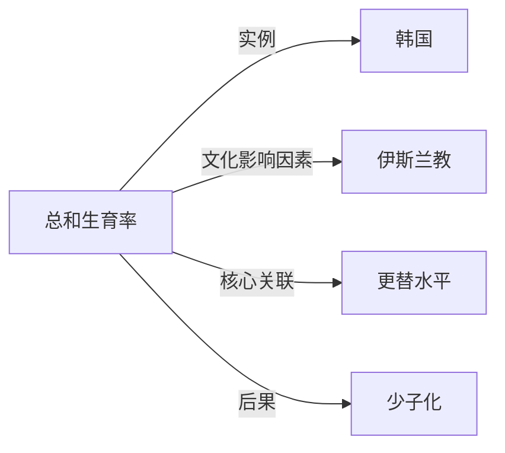

# 总和生育率

## 定义
总和生育率（Total Fertility Rate，TFR）是假设一批妇女按照某一年的年龄别生育率度过整个育龄期，平均每个妇女一生所生育的子女数。

## 核心解释
总和生育率是一个时期合成指标，将当年各年龄组育龄妇女（通常15-49岁）的生育率加总，反映在现行生育水平下一位女性预期的终身生育数量。它不是真实的队列终身生育数，而是假想队列的测算，能剔除年龄结构影响，便于跨时间、跨地区比较。通常认为总和生育率在2.1左右为更替水平，低于1.5为“很低生育率”，低于1.3为“极低生育率”。常见误解是将它等同于某一年出生人数除以育龄妇女人数，忽略了年龄结构差异。

## 示例
- 2022年韩国的总和生育率降至0.78，意味着按当年生育模式，平均每名女性一生仅生育不到一个孩子。
- 尼日尔的总和生育率长期保持在6.8以上，反映其高生育模式的延续。

## 关联概念
- [[韩国]]：总和生育率全球最低的国家之一，总和生育率低于1，成为少子化与老龄化研究的典型案例。
- [[伊斯兰教]]：在一些以伊斯兰教为主要宗教的国家和地区，宗教规范与生育行为相关，总和生育率往往高于更替水平，但内部差异显著。
- [[更替水平]]：维持人口规模长期稳定的理论生育水平，约合总和生育率2.1，是与总和生育率直接对比的基准。
- [[少子化]]：总和生育率长期低于更替水平时，儿童占比持续下降的现象，直接影响人口结构与经济增长。

## 相关问题
- 总和生育率与一般生育率的区别是什么？
- 为什么总和生育率低于2.1就算低生育率？
- 中国的总和生育率经历了怎样的变化？
- 总和生育率极低的韩国和日本采取了哪些应对政策？
- 总和生育率和出生率哪个更能反映真实生育水平？

## 关系图

