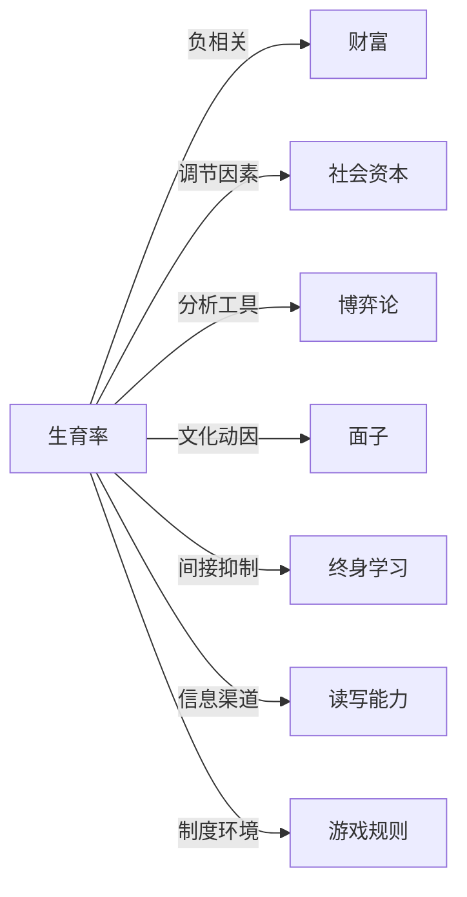

# 生育率

## 定义
生育率是指在一定时期内（通常为一年）每千名育龄妇女所生育的活产婴儿数，常用总和生育率来衡量平均每位妇女一生生育子女的数量。

## 核心解释
生育率反映社会再生产的强度，是人口结构变化的核心指标。它区别于出生率（每千人口出生数）和结婚率，易被混淆。总和生育率通常以2.1为更替水平临界值，高于此数人口倾向长期增长，低于则倾向收缩，但短期还会受年龄结构和迁移影响。低生育率并不直接等于人口立即减少。生育率受经济发展、教育水平、文化观念、社会政策和妇女地位等多重因素综合影响，其下降是现代人口转型的普遍现象。

## 示例
- 某国总和生育率为1.3，意味着按当前年龄别生育率，平均每位妇女一生仅生育1.3个孩子，远低于更替水平。
- 比较尼日尔（总和生育率约7.0）和日本（约1.3），可直观体现不同发展程度下生育水平的巨大差异。

## 关联概念
- [[财富]]：随国家或个人财富水平提高，生育意愿常下降，即生育与收入之间存在替代效应。
- [[社会资本]]：家庭、社区支持网络等社会资本可降低生育成本感知，影响生育决策。
- [[博弈论]]：生育决策可视为夫妻间、代际间或社会成员间的博弈，涉及资源分配与协商。
- [[面子]]：在部分文化中，生育子女数量与家庭荣誉、社会面子相关，影响生育动机。
- [[终身学习]]：妇女受教育年限延长及终身学习参与，常推迟婚育年龄并降低生育数量。
- [[读写能力]]：读写能力影响避孕知识获取和生殖健康决策，进而调节生育率水平。
- [[游戏规则]]：产假、育儿补贴、托育服务等政策构成生育“游戏规则”，改变生育成本与收益。

## 相关问题
- 为什么经济越发达的地区生育率往往越低？
- 生育率长期低于更替水平会带来哪些社会和经济后果？
- 哪些政策措施能有效提升生育率？

## 关系图

