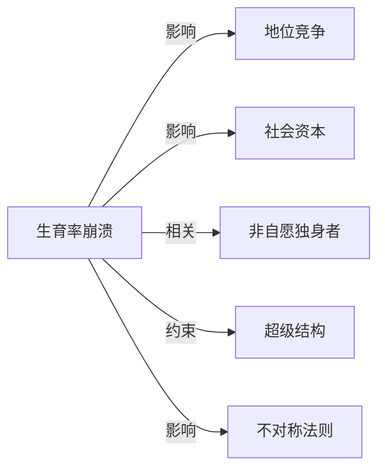

# 生育率崩溃

## 定义
生育率崩溃指一个国家或地区的总和生育率（TFR）持续、显著降至远低于人口更替水平（约2.1），并长期无法回到该水平的现象，导致人口规模萎缩与年龄结构急剧老化。

## 核心解释
生育率崩溃并非简单的出生人数减少，而是社会系统性反馈的结果：当生育率跌破某个临界值后，经济负担、住房压力、教育内卷、性别角色冲突和个体化价值观等相互强化，使生育意愿与生育能力形成螺旋式下降。它与过渡性生育下降不同，具有路径依赖和不可逆倾向。常见误解包括将其等同于暂时性少子化，或认为仅发生于高度发达国家；实际上，中等收入国家同样面临此风险。

## 示例
- 韩国总和生育率在2023年降至0.72，为全球最低，持续剧烈收缩
- 日本自1970年代中生育率跌破更替水平后，长期低迷，人口连续十多年负增长
- 意大利、西班牙等南欧国家在21世纪初生育率跌至1.2以下，至今未恢复

## 关联概念
- [[地位竞争]]：激烈的教育和工作地位竞争抬高了养育孩子的实际成本与心理期待，促使许多人推迟或放弃生育，构成生育率崩溃的核心微观动力
- [[社会资本]]：家庭与社区的互助网络、信任水平下降，削弱了多育的支持系统，使生育决策更加依赖个体资源，加剧生育率下滑
- [[非自愿独身者]]：婚配困难与亲密关系形成受阻直接减少了生育基数，反映出生育率崩溃背后的两性关系与市场匹配危机
- [[超级结构]]：高昂的住房成本、刚性教育体系、劳动市场二元化等超级结构，构筑了难以用个人努力克服的生育壁垒
- [[不对称法则]]：少数受益群体与多数受损群体在资源分配上极度不对称，导致大多数家庭感受到的相对剥夺感上升，进一步压低生育意愿

## 相关问题
- 为什么生育率一旦跌破更替水平就极难自然而然地恢复？
- 生育率崩溃对一个国家的社会保障、经济增长和创新有哪些深远影响？
- 政策干预（如现金补贴、育儿假）为何常常效果有限，难以根本逆转生育率崩溃？
- 社会规范变化与性别平等在生育率崩溃中扮演什么角色？

## 关系图

