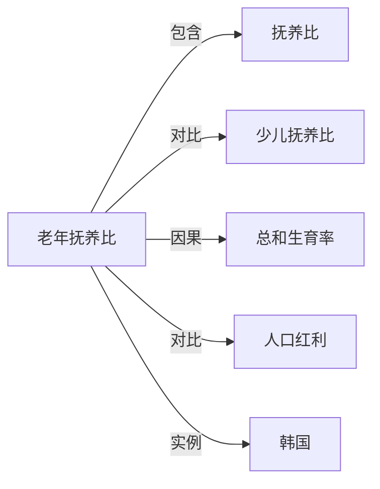

# 老年抚养比

## 定义
65 岁及以上人口与劳动年龄人口（通常指 15—64 岁）之比，衡量一个社会赡养老年人的相对负担。

## 核心解释
老年抚养比 =（65 岁及以上人口 ÷ 15—64 岁人口）× 100%。人口老龄化会直接推高老年抚养比，进而影响养老金、医疗与长期照护等社会保障体系的可持续性；它也常与劳动年龄人口不足、经济增长放缓等问题相伴出现。

## 示例
- 日本、韩国等低生育率国家老年抚养比快速攀升，社保与护理支出压力显著增大。
- 海湾国家因大量外籍年轻劳动力流入，统计口径区分公民与非公民时，本国人口老年抚养比可能更高。

## 关联概念
- [[抚养比]]：老年抚养比是总抚养比的组成部分之一。
- [[少儿抚养比]]：与老年抚养比并列，衡量抚养未成年人的负担。
- [[总和生育率]]：长期低生育率是老年抚养比上升的主要驱动因素。
- [[人口红利]]：老年抚养比上升意味着人口红利趋于消退。
- [[韩国]]：韩国是全球老年抚养比上升最快的国家之一。

## 相关问题
- 老年抚养比上升是否必然拖累经济增长？
- 延迟退休、移民政策能否缓解老年抚养比上升带来的压力？

## 关系图

