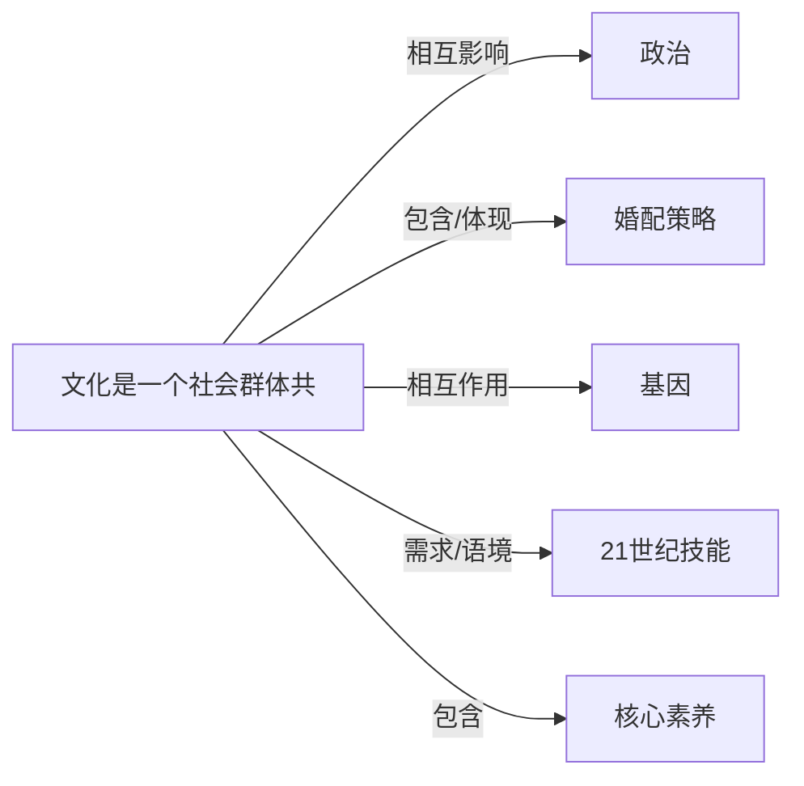

# 文化

## 定义
文化是一个社会群体共享的、习得的信念、价值观、行为规范、符号系统与物质创造的总和，它塑造了群体成员的认知与行为模式。

## 核心解释
文化不是与生俱来的本能，而是通过社会化和教育习得的；它具有群体共享性和代际传承性，以语言、符号为核心载体。文化是动态和整合的，各要素相互关联。常见误解包括将文化窄化为“高雅艺术”或认为文化一成不变，实际上衣食住行、制度习俗等都是文化的一部分。文化与本能（基因驱动）的区别在于其习得性，与个人习惯的区别在于其群体共享性。

## 示例
- 使用筷子进食的餐桌礼仪与背后的人际秩序
- 中国传统婚礼中的“三书六礼”婚配仪式
- 互联网开源社区的协作规范与共享价值观

## 关联概念
- [[政治]]：政治制度深嵌于文化价值观之中，政治实践又不断重塑文化认同与公共文化。
- [[婚配策略]]：婚配策略是文化在婚姻制度与性选择规范上的具体体现，深受亲属结构、宗教等文化因素约束。
- [[基因]]：基因-文化协同进化理论指出，文化环境能改变选择压力，进而影响基因频率，二者共同塑造人类行为。
- [[21世纪技能]]：21世纪技能框架突出跨文化能力、文化敏感性与全球公民意识，这些技能需在具体文化语境中培养。
- [[核心素养]]：核心素养中的“文化基础”维度直接涵盖人文积淀、人文情怀与文化理解，强调文化在人的全面发展中的根基作用。
- [[教育理想目的]]：教育理想目的总是嵌入特定文化传统，文化为其提供价值内容，也构成其表达的边界。
- [[人口]]：人口规模、密度与多样性催生特定文化形态，而宗教、生育观念等文化因素又直接作用于生育率与人口行为。
- [[制度]]：文化是制度的精神内核与意义来源，制度则是文化的结构化表达，两者相互塑造。

## 相关问题
- 文化、文明与社会这三个概念有何区别与联系？
- 文化相对主义的核心主张及其边界是什么？
- 全球化的文化同质化与本土化之间如何互动？

## 关系图

