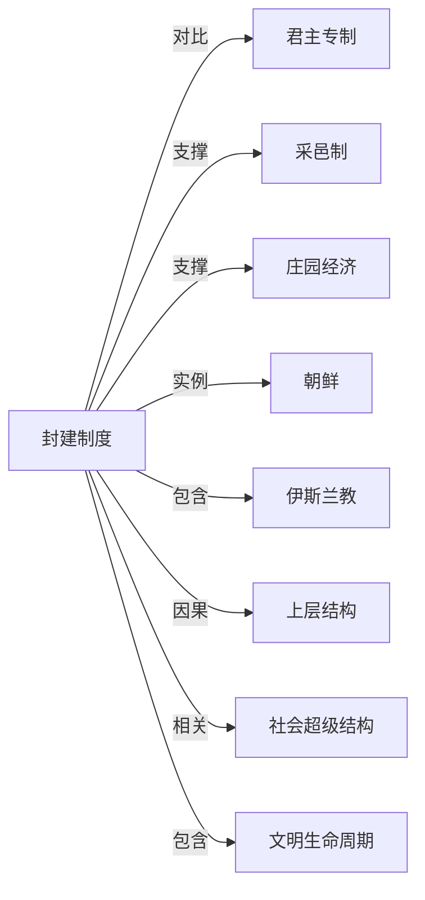

# 封建制度

## 定义
封建制度是以土地分封和人身依附关系为核心，通过领主与附庸之间的契约义务构建起来的一种分权化政治、经济与社会制度。

## 核心解释
该制度的关键在于统治权力被逐级分割，领主向附庸授予土地（采邑），附庸则提供军事服务和其他义务，形成层级化的效忠与保护网络。其边界在于：它既不同于完全基于血缘的部落制，也不同于权力高度集中的君主专制或帝国官僚制。常见误解是将一切前现代农业社会、尤其是秦统一后的中国古代社会笼统称为“封建”，这与以分权、契约和庄园经济为特征的狭义封建制度有本质区别。

## 示例
- 西欧中世纪（9–15世纪）以采邑制为基础的封建等级体系，国王、公爵、伯爵、骑士层层分封。
- 日本镰仓至战国时代以幕府和守护地头制为核心的封建体制，将军与御家人通过土地恩赏结成主从关系。

## 关联概念
- [[君主专制]]：封建制度下君主权力受封臣契约掣肘，而君主专制则权力高度集中于中央，常被用作封建制瓦解后国家形态的对标。
- [[采邑制]]：采邑制是封建制度的经济与军事支柱，领主授予附庸土地以换取其效忠和军事服役。
- [[庄园经济]]：以自给自足的庄园为生产单位，农奴被束缚于土地，构成封建制度下主要的资源组织和剥削方式。
- [[朝鲜]]：朝鲜高丽王朝的田柴科制度及后续的土地国有私有混合形态，常被视为带有封建色彩的社会结构。
- [[伊斯兰教]]：伊斯兰世界曾出现伊克塔（军事封地）等制度，兼具封建义务与宗教特性，与典型封建制度有相似表象但维系逻辑不同。
- [[上层结构]]：封建土地所有制和人身依附关系构成经济基础，决定了等级君主制、骑士精神、经院哲学等上层建筑。
- [[社会超级结构]]：封建制度作为一种具体的社会组织形态，其权力合法性、等级秩序往往需要当时的宗教或意识形态等超级结构来提供终极辩护。
- [[文明生命周期]]：许多文明在农业生产秩序稳定后演化出封建制度，成为其成长阶段或过渡阶段的典型社会结构

## 相关问题
- 封建制度与中央集权官僚制最主要的区别是什么？
- 封建制度下的经济如何持续运转，庄园制在其中起什么作用？
- 为什么中国的封建概念与欧洲的 feudalism 指涉差异巨大？
- 封建制度是如何从兴盛走向衰落的？

## 关系图

