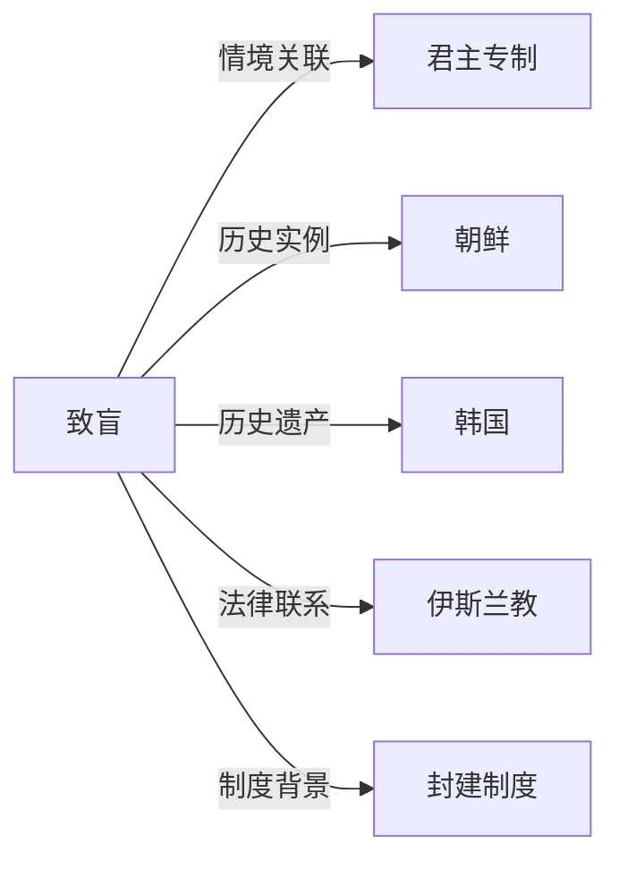

# 致盲

## 定义
致盲是指通过物理手段故意且永久性地剥夺他人视力的行为，历史上常作为一种酷刑或刑罚。

## 核心解释
致盲是一种极端的人身摧残方式，其核心在于永久消除个体的视觉能力，以达到惩罚、威慑或清除政治对手的目的。不同于战争中偶然性失明或因疾病致盲，致盲强调主观故意和惩罚属性。在君主专制和封建社会，它常被用于处置皇位威胁者、叛乱者或严重罪犯。不同文化中，致盲的实施方式和法律定位有别，有的是司法判决，有的则是权力斗争中的私刑。

## 示例
- 朝鲜王朝时期，部分失势的王室成员或政敌被处以致盲刑罚，以消除其政治威胁。
- 拜占庭帝国将致盲作为对篡位者或政治竞争者的常见惩处，使其丧失成为皇帝的资格。

## 关联概念
- [[君主专制]]：致盲常在君主专制政体中被用作维护皇权、消除继承威胁的极端手段。
- [[朝鲜]]：朝鲜历史上有用致盲处置失势贵族或王族成员的事例，反映君主集权下的惩罚方式。
- [[韩国]]：韩国的前现代史中，致盲作为过去刑罚的一种遗存，成为反思君主专制暴力的一部分。
- [[伊斯兰教]]：在部分伊斯兰教法中，基于“以眼还眼”的同态复仇原则，致盲可作为对故意使人失明的报复刑罚。
- [[封建制度]]：在权力高度集中于少数人的封建制度下，致盲成为处理权力斗争的一种残酷形式。

## 相关问题
- 致盲刑罚在哪些文明和历史阶段被正式采用？
- 致盲与其他身体刑（如断肢、割鼻）在象征意义上有什么不同？
- 不同法律体系如何对待以报复为目的的致盲？

## 关系图

