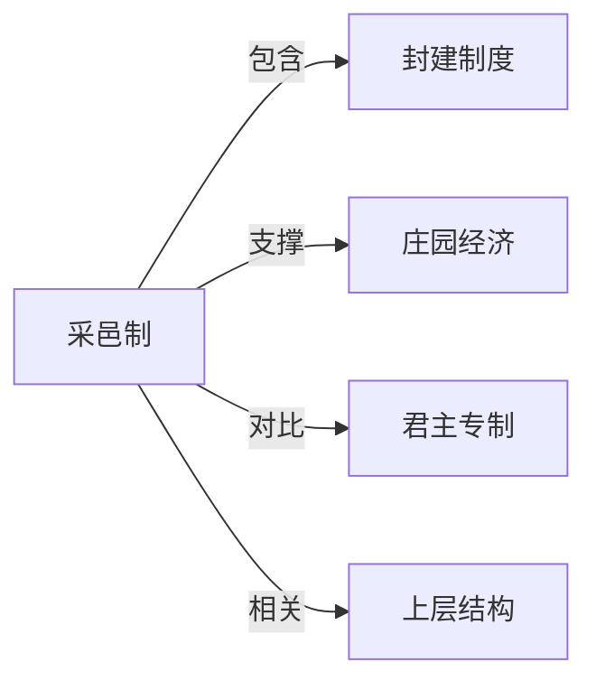

# 采邑制

## 定义
中世纪封建制度下，领主将土地（采邑/封地）授予附庸，以换取其效忠、军事服役与贡赋的制度安排。

## 核心解释
采邑制把土地占有与兵役义务绑定，形成层层分封的封建等级关系，是封建制度的经济与军事支柱。采邑最初多为终身制，后逐渐演变为世袭，强化了地方贵族的独立性，是欧洲中世纪政治分散格局的重要成因。

## 示例
- 查理·马特改革推行采邑制，为加洛林王朝提供了以骑兵为核心的军事力量。
- 骑士以封地收入装备自身，履行对领主的军事服役义务。

## 关联概念
- [[封建制度]]：采邑制是封建制度的核心制度安排。
- [[庄园经济]]：采邑与庄园构成封建制度下土地组织和生产的基本单位。
- [[君主专制]]：采邑制的世袭化与地方割据，与君主专制的中央集权形成对比。
- [[上层结构]]：采邑制作为经济基础的一部分，塑造了骑士精神、等级观念等上层建筑。

## 相关问题
- 采邑制与庄园经济是什么关系？
- 采邑制世袭化如何加剧了封建分裂？

## 关系图

