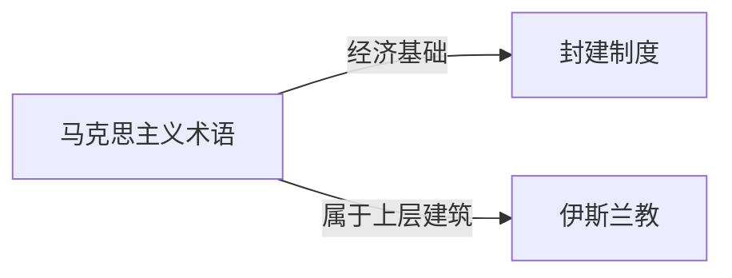

# 上层结构

## 定义
马克思主义术语，指建立在社会经济基础之上并与之相适应的政治、法律、宗教、艺术、哲学等意识形态及相应的制度与设施。

## 核心解释
上层建筑由经济基础决定，并反过来维护或破坏经济基础。它包含两个层面：一是思想上层建筑（政治法律思想、道德、艺术、宗教、哲学等），二是政治上层建筑（国家政权、法律体系、军队、政党等）。常见误解是把它等同于政府或国家机器，忽略了它也包括观念和意识形态。它不是独立发展的，最终变更取决于经济基础的变革。

## 示例
- 资本主义国家的代议制民主和三权分立制度及其自由主义意识形态
- 中世纪的基督教教会及其神学体系，与封建庄园经济相适应

## 关联概念
- [[封建制度]]：封建土地所有制和人身依附关系构成经济基础，决定了等级君主制、骑士精神、经院哲学等上层建筑。
- [[伊斯兰教]]：作为一种宗教意识形态及其制度（如沙里亚法、乌玛组织），是特定历史条件下经济基础的上层反映。

## 相关问题
- 上层建筑如何反作用于经济基础？
- 科学技术是否属于上层建筑？
- 意识形态的变革如何影响政治上层建筑？

## 关系图

