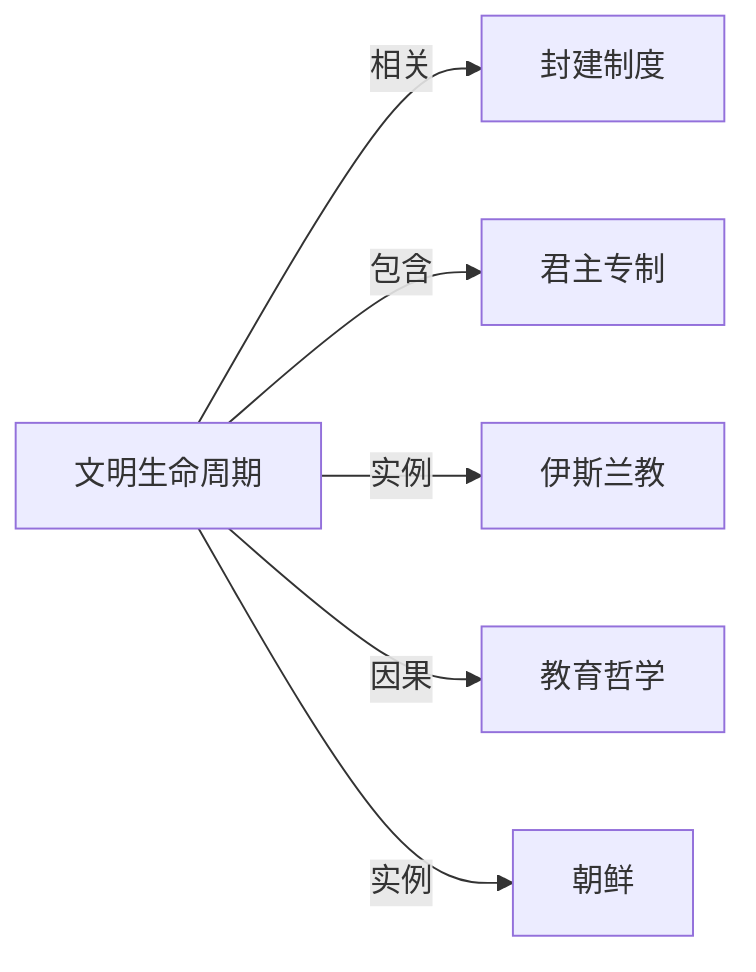

# 文明生命周期

## 定义
一种认为文明如同有机体，会经历兴起、成长、鼎盛、衰落和解体等阶段的理论模型。

## 核心解释
该概念把文明视为一种有始有终的动态系统，强调其内在活力、制度效能和文化创造力的消长。它既不同于简单的线性进步观，也不等同于单纯的循环论，而是强调在特定条件下，文明应对内部矛盾与外部挑战的能力最终会达到极限而走向转型或消亡。常见误解是把文明生命周期直接等同于生物老化，而忽略了社会主动变革和跨文明吸收养分所带来的弹性。

## 示例
- 汤因比认为西方文明在经历过空前的物质繁荣后，正面临精神分裂与制度僵化的挑战期
- 玛雅古典期文明在城邦制度、天文历法和艺术方面达到顶峰，随后因生态压力、战争和内乱走向崩溃

## 关联概念
- [[封建制度]]：许多文明在农业生产秩序稳定后演化出封建制度，成为其成长阶段或过渡阶段的典型社会结构
- [[君主专制]]：中央集权的君主专制常出现在文明鼎盛期，用于维护庞大疆域的整合，但也可能固化而加速文明的僵化
- [[伊斯兰教]]：伊斯兰文明从7世纪起迅速扩张，经历黄金时代后因内部教派分立和外部冲击进入不同周期的演化，是生命周期理论的一个典型研究对象
- [[教育哲学]]：教育哲学所塑造的知识传承与批判思考方式，决定着文明能否不断自我反思、创新以推迟衰落期
- [[朝鲜]]：朝鲜半岛文明在东亚大文明圈的框架下，表现出受地缘政治和有限资源约束的独特生命周期节律

## 相关问题
- 文明生命周期理论有哪些主要代表人物和流派？
- 如果一个文明进入衰落期，是否有可能重获新生或演化为新的文明形态？
- 文明生命周期的长短是否主要由地理环境决定？

## 关系图

