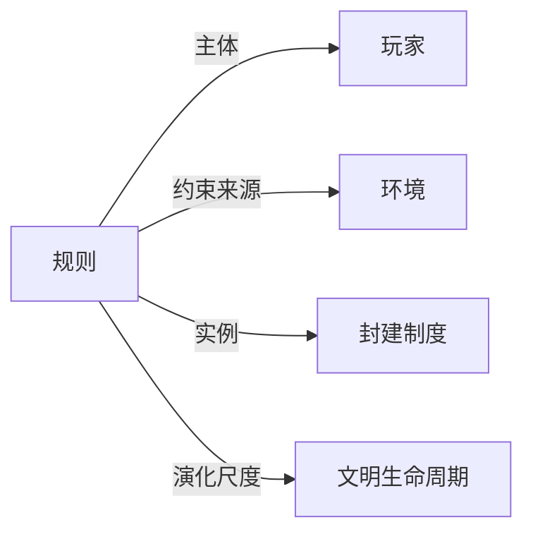

# 规则

## 定义
规则是对行为、过程或结构进行约束、引导和评价的明确或隐含的准则。

## 核心解释
规则的核心是为特定范围内的行动提供可预测性和秩序。它可以是明文的（如法律、协议），也可以是默会的（如习俗、语法规则）。关键边界在于：规则必须针对可重复的情境，且不因单次结果而随意改变；它与‘规律’不同，规律描述事实而不具备规范性，规则带有‘应当如何’的指令性。常见误解是认为规则必然人为制定，其实自然语言语法、生物体自组织中的约束也可视为广义的规则。

## 示例
- 交通信号灯让行规则约束车辆和行人行为，降低事故率。
- 围棋的落子与提子规则定义了合法棋步与胜负条件，构建了游戏空间。
- 自然选择是一种环境施加的淘汰规则，使适应度更高的基因型更易延续。

## 关联概念
- [[玩家]]：规则为玩家提供行动框架，玩家在规则边界内做出决策，二者共同产生博弈结果。
- [[环境]]：规则可以内生于环境（如生态位约束），也可以是外部设计的，环境为规则提供执行背景与反馈。
- [[封建制度]]：封建制度是一套关于土地权、效忠和等级义务的复合规则体系，长期约束中世纪欧洲的社会行为。
- [[文明生命周期]]：规则的存续与更替塑造文明的兴起、僵化与崩溃，构成文明生命周期背后的制度动力。

## 相关问题
- 规则与规律的根本区别是什么？
- 规则是如何在无设计者的情况下自发产生的？
- 什么条件下规则会成为创新的阻碍？

## 关系图

