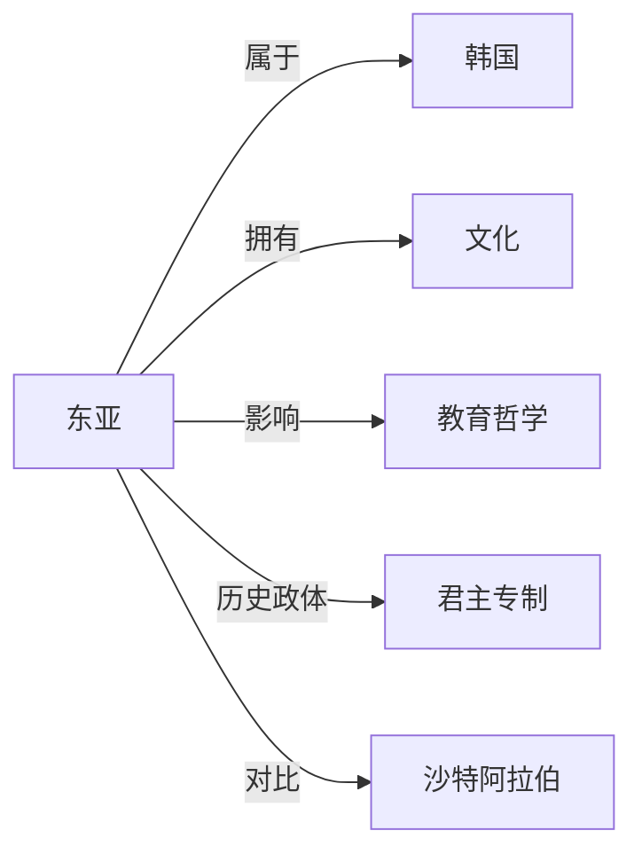

# 东亚

## 定义
东亚是指亚洲东部的一个地理和文化区域，通常包括中国、日本、韩国、朝鲜和蒙古等国家。

## 核心解释
东亚既是一个地理概念，也是一个历史悠久的文化圈。地理上，它位于亚洲大陆东部，濒临太平洋，气候以温带和亚热带季风为主。文化上，东亚深受汉字、儒家思想、佛教和律令制度的影响，形成了具有内在关联的“东洋文化圈”。常见的误解是将东南亚国家（如越南）或俄罗斯远东地区不加区分地划入东亚；越南在文化上常被视为东亚文化圈的一员，但地理上属东南亚。

## 示例
- 东亚的主要国家包括中国、日本、韩国、朝鲜和蒙古。
- 东亚季风区夏季高温多雨，对水稻种植农业影响深远。
- 儒家文化是东亚历史上许多王朝的共同思想基础。

## 关联概念
- [[韩国]]：位于朝鲜半岛南部的东亚国家
- [[文化]]：东亚形成以汉字、儒学、佛教等为纽带的区域文化传统
- [[教育哲学]]：东亚教育思想与制度长期受儒家教育哲学和科举传统塑造
- [[君主专制]]：前近代东亚普遍存在以皇帝或国王为核心的中央集权专制政体
- [[沙特阿拉伯]]：作为西亚国家，与东亚在地理位置、文化传统和宗教方面形成显著对照

## 相关问题
- 东亚具体包括哪些国家和地区？
- 东亚文化圈与汉字文化圈有何关系？
- 为什么越南有时被视为东亚文化圈的一部分？
- 东亚的现代化路径有何共性与差异？

## 关系图

