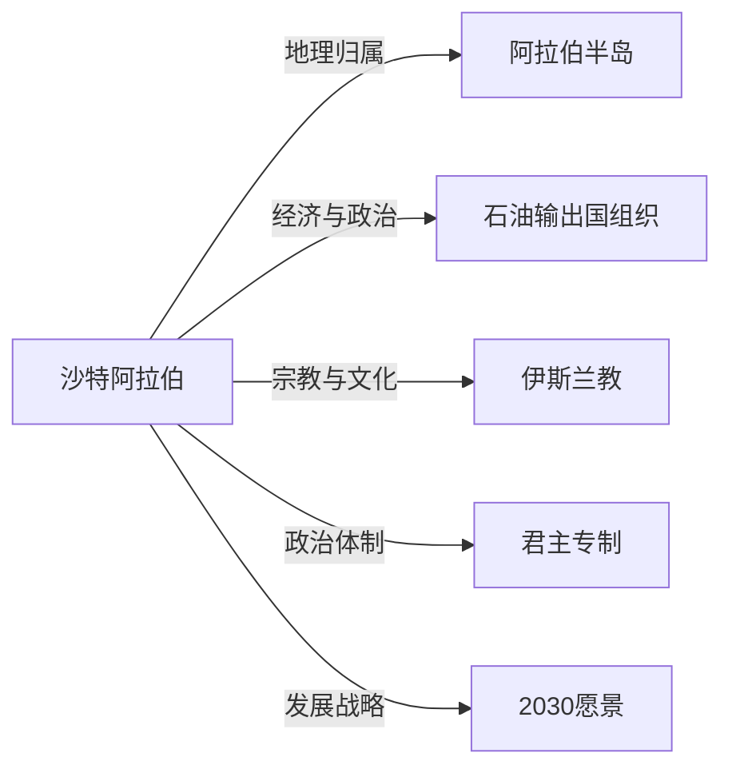

# 沙特阿拉伯

## 定义
沙特阿拉伯（Saudi Arabia）是位于亚洲西南部阿拉伯半岛的国家，全称沙特阿拉伯王国，实行君主专制，以伊斯兰教为国教，是全球最大的石油出口国。

## 核心解释
沙特阿拉伯占据阿拉伯半岛大部分面积，东临波斯湾，西濒红海。其政治体制为绝对君主制，国王兼任首相，握有行政、立法、司法大权。经济高度依赖石油资源，石油收入占国家财政收入的绝大部分，近年来在“2030愿景”下推进经济多元化。沙特是伊斯兰教两大圣城麦加和麦地那的所在地，在伊斯兰世界具有特殊宗教地位。社会文化深受瓦哈比派影响，曾长期实行严格的性别隔离和保守习俗，近年逐渐放开。常见误解包括将沙特等同于所有阿拉伯国家，或忽略其内部正在发生的社会经济变革。

## 示例
- 沙特阿拉伯拥有世界已探明石油储量的约五分之一，是全球最大的原油出口国。
- 麦加是伊斯兰教最神圣的城市，每年有数百万穆斯林前往朝觐。

## 关联概念
- [[阿拉伯半岛]]：沙特阿拉伯位于阿拉伯半岛，是该半岛面积最大的国家。
- [[石油输出国组织]]：沙特是石油输出国组织（OPEC）的创始成员国和事实上的领导国，对全球油价有重大影响力。
- [[伊斯兰教]]：伊斯兰教是沙特的国教，该国的法律和社会规范深受伊斯兰教法（沙里亚）影响。
- [[君主专制]]：沙特实行的是以沙特家族为核心的绝对君主制，政治权力集中在国王手中。
- [[2030愿景]]：沙特王储穆罕默德·本·萨勒曼提出的经济和社会改革计划，旨在减少对石油的依赖。

## 相关问题
- 为什么沙特阿拉伯的石油储量如此丰富？
- 沙特阿拉伯的瓦哈比派伊斯兰教与其他教派有何不同？
- 沙特阿拉伯的女性权利现状如何？
- 沙特阿拉伯与美国的关系经历了哪些变化？

## 关系图

