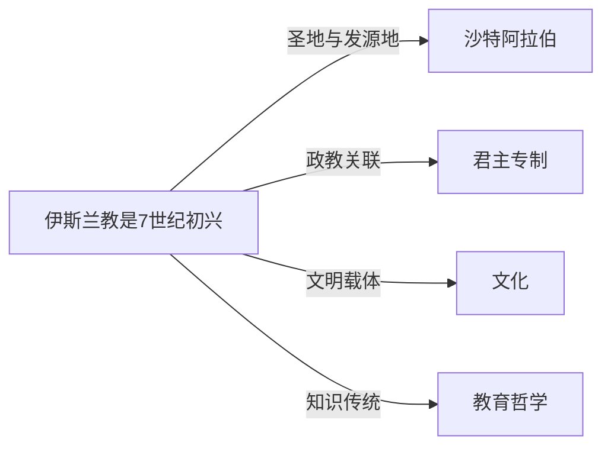

# 伊斯兰教

## 定义
伊斯兰教是7世纪初兴起于阿拉伯半岛的一神论宗教，信仰真主安拉，尊奉先知穆罕默德为最后一位使者。

## 核心解释
伊斯兰教核心教义为“信安拉、信天使、信经典、信使者、信末日、信前定”，五功（念、礼、斋、课、朝）为基本宗教实践。其经典为《古兰经》与圣训。常被误解为单一政治意识形态或与恐怖主义必然关联，实际伊斯兰教内部教法、教派及文化表达极为多元，且其教义包含和平、顺从与平等的主张。伊斯兰教不仅是一套信仰体系，也是一套涵盖法律、伦理、社会秩序的生活方式，其边界在于以认主独一和跟随穆罕默德圣行为核心，任何偏离这一根本的信仰不被视为伊斯兰正统。

## 示例
- 每日五次面向麦加礼拜是伊斯兰教五功之一。
- 逊尼派与什叶派的分化源于对穆罕默德继承人合法性的分歧。

## 关联概念
- [[沙特阿拉伯]]：伊斯兰教诞生于阿拉伯半岛，沙特阿拉伯境内拥有麦加和麦地那两大圣城，是全球穆斯林朝觐的核心所在。
- [[君主专制]]：部分伊斯兰国家如沙特阿拉伯采用君主专制政体，以伊斯兰教法为重要统治依据，体现宗教与政治体制的结合。
- [[文化]]：伊斯兰教深刻影响了中东、北非、南亚等地区的文化形态，包括艺术、建筑、文学、法律与日常生活习俗。
- [[教育哲学]]：伊斯兰教重视求知，历史上经学院与智慧馆推动了哲学、科学等学问的传承，形成独特的教育哲学传统。

## 相关问题
- 伊斯兰教与基督教、犹太教的主要异同是什么？
- 伊斯兰教法在当代不同国家如何适用与演变？
- 逊尼派与什叶派的主要分歧及分布情况如何？
- 伊斯兰教如何回应现代性与世俗化的挑战？

## 关系图

