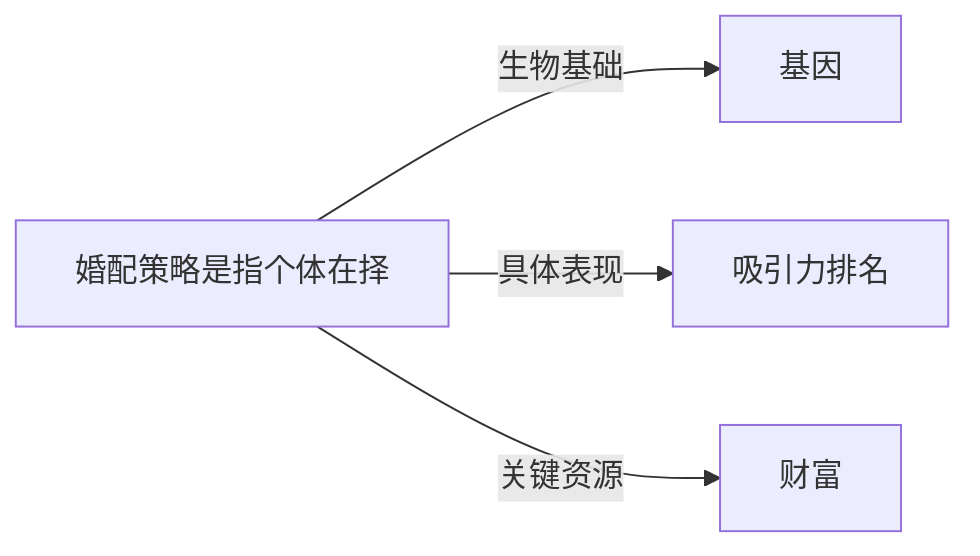

# 婚配策略

## 定义
婚配策略是指个体在择偶过程中倾向采用的一系列心理偏好、行为模式和决策规则，旨在提高繁殖成功率或伴侣关系质量。

## 核心解释
核心内涵包括：基于进化心理学的性选择理论，个体通常拥有长期（注重承诺、资源、共同养育）和短期（注重外貌、即时可得性）两种策略，并根据自身条件与环境灵活切换。边界在于这并非有意识的算计，而是深层心理倾向。常见误解是将策略等同于刻板性别角色，忽略个体差异、文化重塑作用以及现代社会中繁殖目标与情感目标的分离。

## 示例
- 在进化环境中，女性因生育投入大而更偏好资源丰富、愿意投资的长期伴侣，表现为对男性经济前景和地位的重视。
- 短期策略中，男性可能降低择偶标准，追求更多性伴侣以扩大繁殖机会，这在约会应用中的快速选择行为中得到体现。

## 关联概念
- [[基因]]：婚配策略的终极目标是基因传递，择偶偏好实质上是为筛选优质基因或适应性基因载体服务的心理机制。
- [[吸引力排名]]：个体根据自身婚配策略，对潜在伴侣的颜值、资源、地位等属性进行权重排序，形成吸引力评估。
- [[财富]]：在长期婚配策略中，财富是男性提供亲代投资能力的重要信号，常被女性作为核心择偶标准之一。

## 相关问题
- 男女在长期和短期婚配策略上有哪些典型差异？
- 现代避孕技术与女性经济独立如何改变传统婚配策略？
- 为什么个体有时会混合使用两种策略，其心理调适机制是什么？

## 关系图

