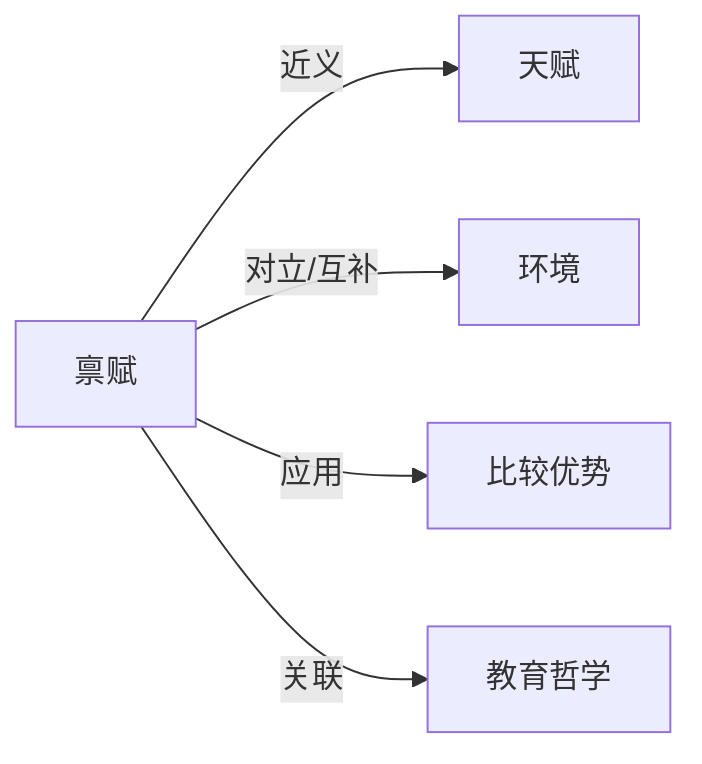

# 禀赋

## 定义
个体天生具备的资质、潜能或所拥有的初始资源条件。

## 核心解释
禀赋在中文语境中常与“天赋”互通，指向个人与生俱来的生理、智力或性格特质，是后天发展的基础。经济学中引申为个体或经济体初始拥有的生产要素（如土地、劳动、资本）组合。关键边界在于禀赋强调先天或初始给定，区别于后天习得的技能与积累的财富。常见误解是将禀赋等同于现实成就，忽略了后天环境与个人努力的中介作用。

## 示例
- 一个孩子天生对音高和节奏敏感，显示出音乐禀赋。
- 某国因拥有丰富的石油矿藏而具备能源禀赋优势。

## 关联概念
- [[天赋]]：更侧重于先天的智力或特殊才能，是禀赋的核心部分。
- [[环境]]：禀赋代表先天因素，环境则代表后天影响，二者共同塑造个体发展。
- [[比较优势]]：经济学中，要素禀赋结构决定了一国的比较优势产业。
- [[教育哲学]]：探讨先天禀赋与后天教育在人的形成中的各自作用。

## 相关问题
- 禀赋与后天努力哪个对成功影响更大？
- 如何识别和开发儿童的特殊禀赋？
- 资源禀赋丰裕为什么有时会导致经济落后（资源诅咒）？

## 关系图

