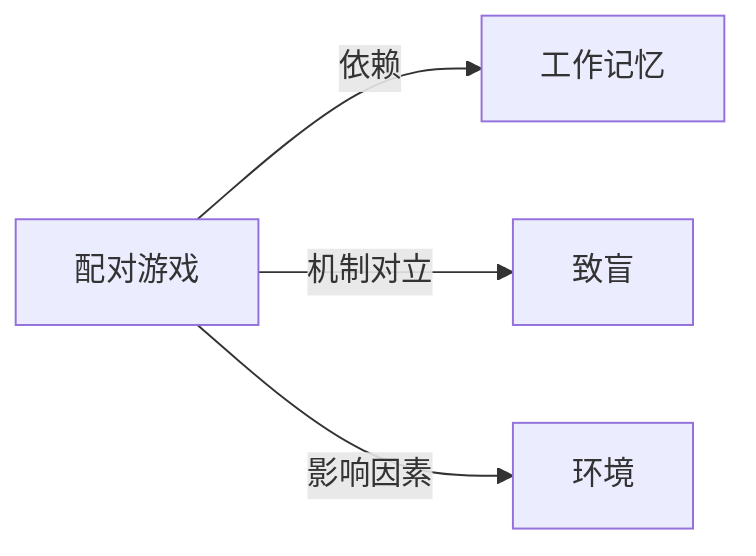

# 配对游戏

## 定义
一种通过翻找、匹配相同或关联卡牌来锻炼记忆与注意力的经典认知游戏。

## 核心解释
核心机制是参与者轮流翻开隐藏的卡牌，寻找成对匹配的图案或文字，若匹配成功则保留翻开状态，失败则重新隐藏，以此考验并提升工作记忆、空间定位和专注力。常被误认为是纯粹的儿童游戏，实际上也广泛用于认知康复、实验心理学研究及脑力训练。

## 示例
- 实体桌游“记忆棋”或“配对卡牌”，翻开两张牌若图案相同即赢得该对。
- 数字配对游戏App，在限定时间内找出所有数字相同的格子对。

## 关联概念
- [[工作记忆]]：配对游戏直接依赖对卡牌位置和内容的短暂保持与操作，是工作记忆训练的典型范式。
- [[致盲]]：配对游戏要求信息透明化后的记忆，而致盲设计则刻意隐藏信息，两者在游戏机制上形成对照。
- [[环境]]：游戏表现易受环境干扰，如噪音或视觉杂乱会加重认知负荷，降低配对成功率。

## 相关问题
- 为什么配对游戏能有效锻炼记忆力？
- 配对游戏的难度如何随卡牌数量增长而变化？
- 在实验中如何利用配对游戏研究空间记忆？

## 关系图

