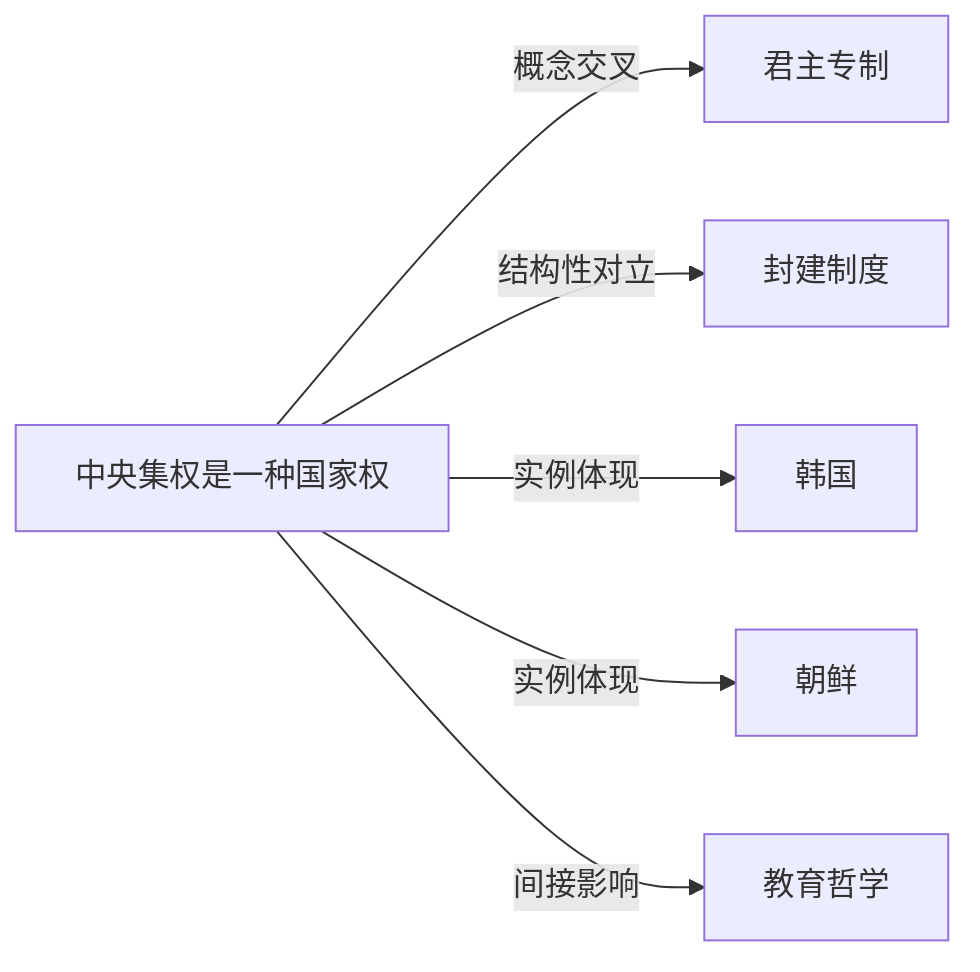

# 中央集权

## 定义
中央集权是一种国家权力结构形式，指国家权力高度集中于中央政府，地方政府在中央的统一决策和领导下行使有限职权的制度安排。

## 核心解释
中央集权的核心在于决策权、财政权和人事权向上集中，地方机关更多是中央政策的执行者。它与地方分权构成治理光谱的两极。常见误解是将中央集权等同于专制或独裁；实际上，民主政体下也可能实行高度中央集权（如法兰西第五共和国），关键在于权力集中的制度设计而非政权性质。中央集权有利于维护国家统一、推行标准化的政策，但可能忽视地方差异，降低治理弹性。

## 示例
- 秦朝废除分封制、推行郡县制，由中央直接任免地方官员，确立了大一统的中央集权框架。
- 法兰西第五共和国在戴高乐时期强化总统与中央行政部门权威，削弱地方议会的自主权，被视为现代民主中央集权的典型。
- 朝鲜在劳动党领导下实行高度中央集权，政治、经济、军事决策均由平壤中央机关掌控。

## 关联概念
- [[君主专制]]：君主专制常以中央集权为组织手段，但中央集权不必依赖君主制，也可存在于共和政体中。
- [[封建制度]]：封建制度下权力分散于各级领主，与权力向上集中的中央集权形成对立；中央集权国家的形成往往伴随对封建体系的取代。
- [[韩国]]：当代韩国实行总统制下的中央集权，中央政府对地方自治体的财政与政策拥有较大支配权。
- [[朝鲜]]：朝鲜是当今世界高度中央集权的政权之一，所有政治经济资源均由中央统一控制和分配。
- [[教育哲学]]：中央集权国家往往统一制定教育方针和课程标准，这与教育哲学中关于国家与教育权力的讨论紧密相关。

## 相关问题
- 中央集权与专制主义有何区别？
- 现代民主国家如何平衡中央集权与地方自治？
- 技术进步是加强还是削弱了中央政府对社会的控制能力？

## 关系图

