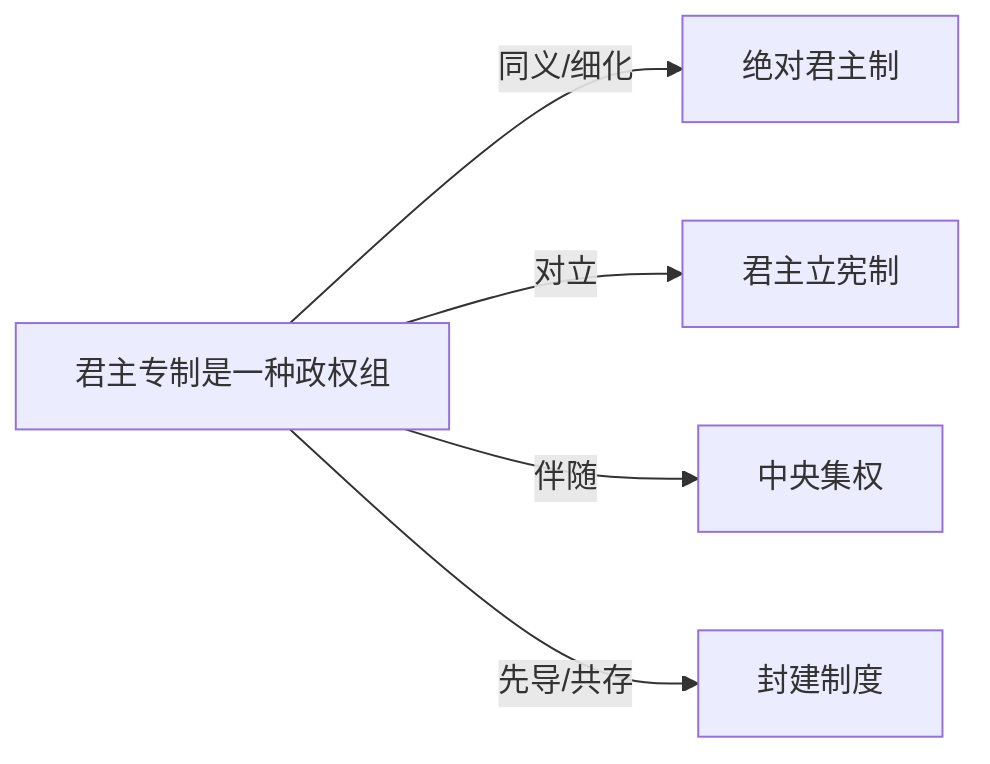

# 君主专制

## 定义
君主专制是一种政权组织形式，其中最高权力完全或实质上集中于一位世袭或终身君主手中，君主通常不受宪法或法律的有效约束。

## 核心解释
君主专制强调君主权力的至高无上性和不可分割性，权力来源通常被解释为“君权神授”或传统继承，君主集立法、行政、司法大权于一身。其核心内涵在于缺乏对君权的制度性制衡，社会等级森严。边界上，它区别于君主立宪制，后者君主的权力受到宪法限制。常见误解是将所有存在国王的国家都视为君主专制，而忽略现代君主立宪制的存在。

## 示例
- 路易十四时期的法国，以“朕即国家”为典型
- 古代中国秦朝至清朝的皇帝制度

## 关联概念
- [[绝对君主制]]：西方语境下常与君主专制互换使用，特指欧洲近代中央集权下的君主制
- [[君主立宪制]]：君主权力受到宪法和议会限制的制度，与君主专制形成根本区别
- [[中央集权]]：君主专制通常依赖高度集中的中央权力体系来维持统治
- [[封建制度]]：欧洲中世纪封建制度下君主权力受限，后期逐渐向君主专制过渡；中国秦以后主要为专制而非封建
- [[致盲]]：致盲常在君主专制政体中被用作维护皇权、消除继承威胁的极端手段。

## 相关问题
- 君主专制与独裁政体有何区别？
- 君主专制为何会在近代欧洲衰落？

## 关系图

