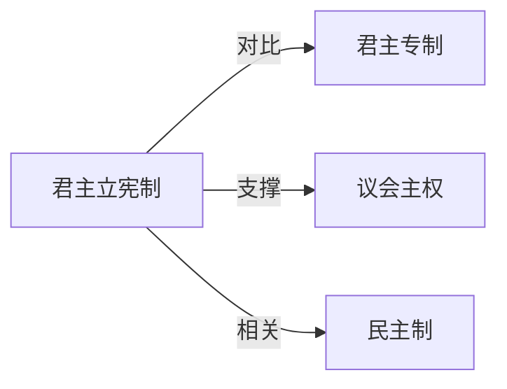

# 君主立宪制

## 定义
君主立宪制是一种在宪法框架下限制君主权力、实行议会主权的国家政体。

## 核心解释
君主立宪制保留了世袭君主作为国家元首，但其权力受宪法和议会的约束，实际治理权由民选议会和内阁行使。核心在于“君主统而不治”，区分于君主专制。常见误解是将君主立宪等同于君主彻底无权，实际上君主仍可能保留一些象征性、仪式性职能或微弱的政治影响（如咨询权、警告权）。它在英国、日本、瑞典等国形态各异，取决于宪法惯例和具体权力安排。

## 示例
- 英国议会君主制：英王是国家元首，但立法、行政权归于议会和内阁。
- 日本天皇制：战后宪法规定天皇为国家和国民统合的象征，不具政治实权。
- 17世纪光荣革命后，英国逐渐确立君主立宪原则。

## 关联概念
- [[君主专制]]：君主专制强调权力不受限制的君主统治，而君主立宪制以宪法限制君主权力，两者构成政体光谱的两端。
- [[议会主权]]：君主立宪制往往与议会主权原则并存，议会拥有最高立法权，君主权力被虚化或仅具象征性。
- [[民主制]]：君主立宪制并不等于民主制，但现代立宪君主国多为民主政体，通过民选机构实现政治制衡。

## 相关问题
- 君主立宪制与君主专制的主要区别是什么？
- 为什么英国保留了君主立宪制？
- 当代哪些国家实行君主立宪制？
- 君主立宪制下君主还有哪些实际权力？

## 关系图

