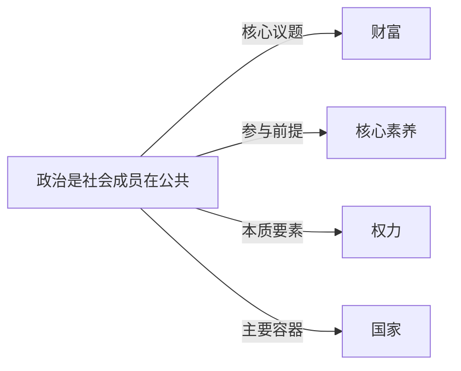

# 政治

## 定义
政治是社会成员在公共领域中围绕权力的获取、行使和限制，以及社会价值的权威性分配所进行的活动、关系和制度安排的总和。

## 核心解释
政治的核心是权力与利益的协调。它不限于政府或国家行为，也渗透在组织、家庭等微观层级。关键内涵包括：谁得到什么、何时如何得到（分配）；冲突的和平解决；公共秩序的生产。常见误解是将政治等同于权术斗争或仅视为选举，忽略了日常协商、制度设计和价值辩论同样是政治行为。其边界与经济（资源生产）、文化（意义建构）交叠，但政治更侧重于带有强制可能性的公共决策。

## 示例
- 议会通过税收法案决定财富再分配
- 社区业主委员会协商公共空间使用规则
- 国际气候谈判中各主权国家围绕减排责任的博弈

## 关联概念
- [[财富]]：财富的生产与分配是政治活动长期关注的核心内容，制度安排直接塑造贫富格局。
- [[核心素养]]：现代民主政治要求公民具备批判性思维与社会参与等核心素养，以实现有效自治。
- [[权力]]：权力是实现政治意图的能力基础，政治过程可视作权力的运用、制衡与合法化。
- [[国家]]：现代政治主要在民族国家框架内展开，国家是垄断合法暴力和制定公共政策的最高组织。

## 相关问题
- 政治与经济的界限在哪里？
- 为什么任何人类社群都会产生政治现象？
- 权力合法性有哪些来源？
- 个体在日常生活中如何参与政治？

## 关系图

