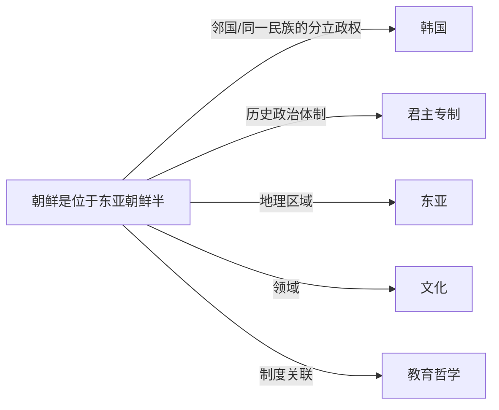

# 朝鲜

## 定义
朝鲜是位于东亚朝鲜半岛北部的社会主义国家，全称朝鲜民主主义人民共和国。

## 核心解释
朝鲜通常指1948年成立的朝鲜民主主义人民共和国，政权由金氏家族领导，实行高度集中的计划经济与先军政治。地理上北接中国和俄罗斯，南以军事分界线与韩国为界。历史语境下，“朝鲜”亦可指1392年至1910年的李氏朝鲜王朝。现代语境中常被误解为完全封闭，实则保持有限外交与特定形式的经济特区。

## 示例
- 平壤是朝鲜的首都及最大城市。
- 朝鲜战争（1950-1953）导致半岛分裂为南北两个政权。

## 关联概念
- [[韩国]]：韩国位于朝鲜半岛南部，与朝鲜在二战后沿三八线分治，形成意识形态与政治体制截然不同的两个国家。
- [[君主专制]]：李氏朝鲜时期实行中央集权的君主专制，儒家思想为国家统治理念。
- [[东亚]]：朝鲜地处东亚，与中、日、韩等国共同构成该地区的文化与政治互动网络。
- [[文化]]：朝鲜文化深受儒教、佛教及本土萨满教影响，并在主体思想指导下发展出独特的国家主导文化形态。
- [[教育哲学]]：朝鲜教育强调集体主义、忠诚于领袖和社会主义意识形态，反映了其教育哲学的政治化特征。

## 相关问题
- 朝鲜和韩国的分裂是如何形成的？
- 朝鲜的主体思想与金日成主义是什么关系？
- 朝鲜在国际社会中的外交与经济现状如何？

## 关系图

