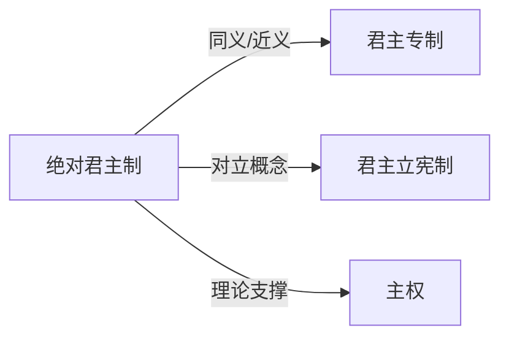

# 绝对君主制

## 定义
绝对君主制是一种君主掌握并行使全部最高统治权力，不受法律或宪政体制实质性约束的政治体制。

## 核心解释
在绝对君主制下，君主（国王、皇帝等）集立法、行政、司法大权于一身，其权力通常被认为源于神授或血统世袭，而非民众授予。该体制区别于立宪君主制，后者君主权力受到宪法和议会的限制。常见误解是将所有君主制都视为绝对君主制，忽略了现代君主立宪制的广泛存在。

## 示例
- 法国路易十四统治时期的“朕即国家”体制
- 沙特阿拉伯实行的以国王为核心、无政党和全国性议会的治理模式

## 关联概念
- [[君主专制]]：两者常互换使用，均指君主不受限制地行使最高权力，细微差别在于专制更强调统治方式的任意性。
- [[君主立宪制]]：君主权力受到宪法和民选机构约束的体制，是绝对君主制的现代转型方向之一，如英国。
- [[主权]]：让·博丹的主权学说为绝对君主制提供了理论基石，主张主权具有不可分割和不受限制的最高性。

## 相关问题
- 绝对君主制与君主专制是完全等同的吗？
- 绝对君主制是如何向立宪君主制或共和制过渡的？
- 为什么伊斯兰世界部分国家现代仍保留绝对君主制特征？

## 关系图

