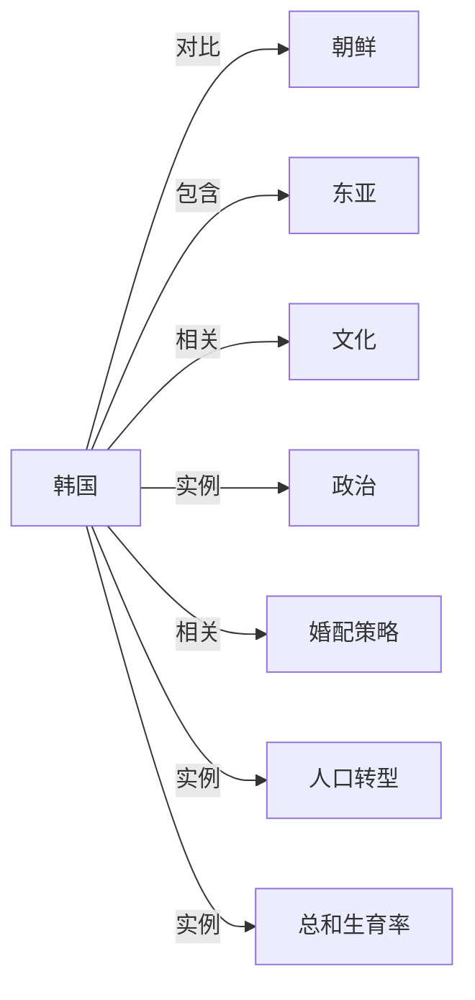

# 韩国

## 定义
韩国是大韩民国的简称，位于朝鲜半岛南部，是一个发达的民主共和制国家。

## 核心解释
韩国在二战后从朝鲜半岛分裂而来，首都为首尔。它以出口导向型经济、发达的科技产业和全球化的文化输出（如K-pop）著称。政治上实行总统制，与北部的朝鲜民主主义人民共和国长期处于对峙状态。常被混淆为整个朝鲜半岛，实际上仅指分界线以南的部分。

## 示例
- 首尔是韩国的首都和最大城市
- 三星电子是韩国最具代表性的跨国企业

## 关联概念
- [[朝鲜]]：同属朝鲜民族，因冷战分裂为两个主权国家，长期处于军事对峙状态。
- [[东亚]]：韩国位于东亚，与日本、中国、朝鲜接壤或隔海相望。
- [[文化]]：韩流文化（K-pop、韩剧）在全球具有广泛影响力，是软实力的重要体现。
- [[政治]]：实行总统制共和制，政党政治活跃，常作为东亚民主化案例研究。
- [[婚配策略]]：韩国社会存在相亲文化、婚介机构以及晚婚不婚现象，涉及家庭策略与性别角色。
- [[人口转型]]：韩国是快速完成人口转型的典型案例，其经验和当前超低生育率问题常被用于分析转型后果。
- [[总和生育率]]：韩国的总和生育率全球最低（低于1），是少子化与老龄化研究的典型案例。

## 相关问题
- 韩国的政治体制有什么特点？
- 韩国经济为何能实现高速增长？
- 韩国与朝鲜的分裂是如何形成的？

## 关系图

