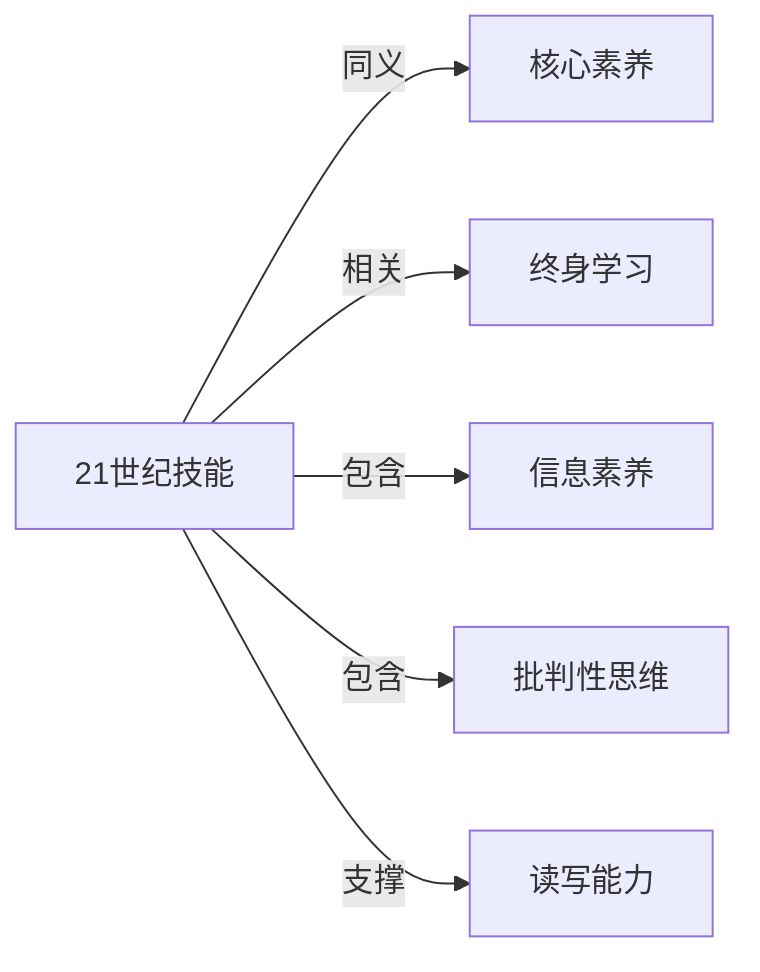

# 21世纪技能

## 定义
21世纪技能是指为适应21世纪信息社会和知识经济要求，个体所需掌握的一系列关键能力与素养的集合。

## 核心解释
它强调超越传统学科知识学习，聚焦于批判性思维、创造力、沟通、协作等可迁移的核心能力，以及信息素养、媒体素养、技术素养等新兴素养。常见误解是将其等同于计算机操作或职业技巧，实际上它更关乎思维方式和在复杂情境中解决问题的能力。其边界涵盖了个人发展、社会参与和职场成功等层面，与“核心素养”等概念一脉相承。

## 示例
- 通过跨学科项目式学习，学生同时锻炼协作、批判性思维和沟通能力。
- 在数字公民课程中，学习识别虚假信息、保护隐私，体现信息素养与媒体素养。

## 关联概念
- [[核心素养]]：核心素养是中国及多国针对21世纪挑战提出的育人目标框架，两者内涵高度重叠，可视为21世纪技能的本土化表述。
- [[终身学习]]：21世纪技能是终身学习的基础，只有具备这些可迁移能力，个体才能持续适应未来社会的快速变化。
- [[信息素养]]：信息素养是21世纪技能的关键构成，指有效获取、评估、利用和创造信息的能力。
- [[批判性思维]]：批判性思维是21世纪技能的核心要素，强调逻辑推理、证据评估和反思判断。
- [[读写能力]]：读写能力是21世纪技能框架中'信息、媒介与技术素养'以及'沟通与协作'的基础，支撑公民在全球化和数字化环境中有效交流和学习。

## 相关问题
- 21世纪技能具体包括哪些能力框架？
- 为什么学校要在传统课程之外特别强调21世纪技能的培养？
- 21世纪技能与“核心素养”有何异同？
- 如何评价或测量一个人的21世纪技能水平？

## 关系图

