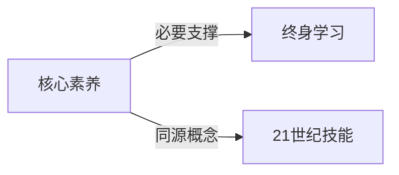

# 核心素养

## 定义
个体适应终身发展与社会进步所必需的品格与关键能力，超越知识与技能的综合素质。

## 核心解释
核心素养强调的不只是“知道什么”，更包括“能做什么”和“愿意成为什么样的人”。其边界在于它不是具体的学科知识，而是跨领域的高阶能力，如批判性思维、合作沟通、信息素养、公民责任等。常见误解是将其等同于考试分数或单一技能证书，实际上它指向人在不确定情境下综合运用知识、技能、态度解决问题的能力。

## 示例
- 一个学生在面对网络谣言时，能主动查证来源、辨别真伪，体现了数字化批判素养。
- 团队项目中，成员能倾听不同意见、协商冲突并达成共同目标，这是合作素养的体现。

## 关联概念
- [[终身学习]]：核心素养是终身学习的核心引擎，终身学习又是核心素养不断发展的途径。
- [[21世纪技能]]：国际上与核心素养高度重叠的框架，强调4C能力（批判性思维、沟通、合作、创新）。

## 相关问题
- 核心素养与应试教育中的“双基”有何本质区别？
- 如何在家庭教育中培养孩子的核心素养？
- 核心素养评价体系如何避免沦为另一种标准化考核？

## 关系图

