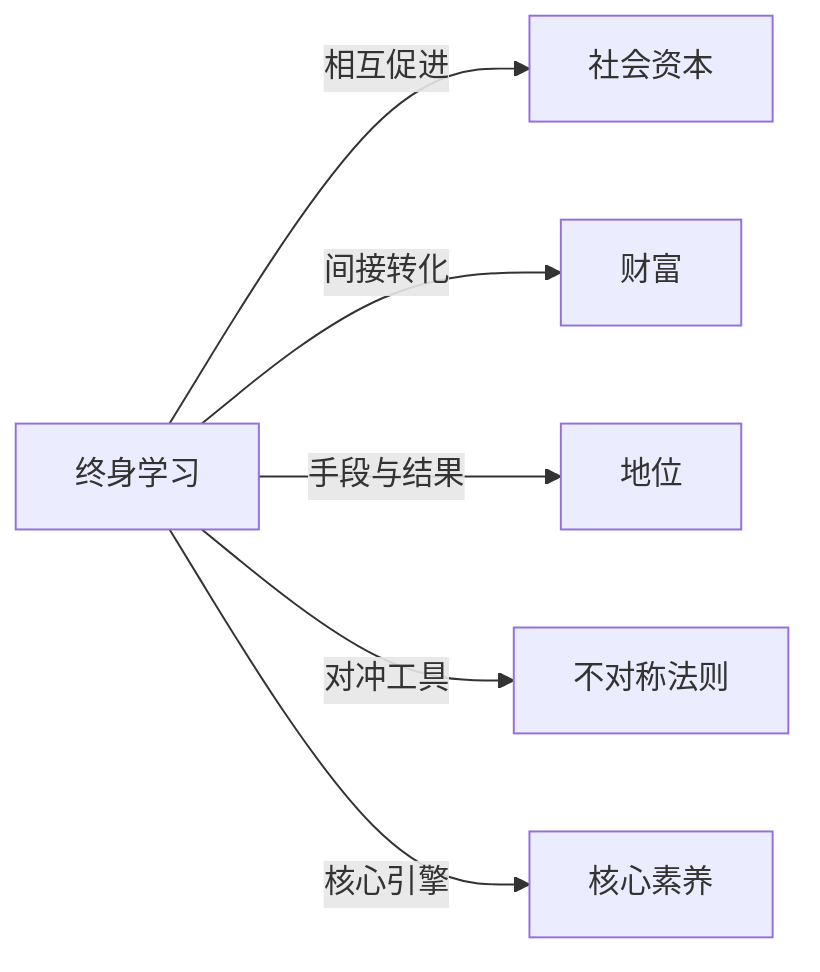

# 终身学习

## 定义
个体在一生中持续、主动地获取知识、技能与智慧的过程，不受年龄、学历或职业阶段的限制。

## 核心解释
终身学习的核心在于打破“学习只发生在学校”的边界，强调学习是一种贯穿生命历程的生存方式和适应机制。它不仅包括正式教育，也涵盖非正式、非正规的学习，如自我导向学习、经验学习和社交学习。常见误解是将终身学习等同于不断考证或被动培训，而忽略其内在驱动、好奇心和对认知的持续更新。

## 示例
- 退休工程师通过在线课程学习哲学并撰写专栏
- 企业管理者定期参加跨行业工作坊以保持战略敏感度

## 关联概念
- [[社会资本]]：终身学习通过拓展人际网络和提升信任度增加社会资本，而丰富的社会资本又为学习提供信息渠道和协作机会
- [[财富]]：持续学习积累的人力资本是获取财富的关键生产要素，但学习本身不一定直接带来财富，需经过应用与市场转化
- [[地位]]：通过终身学习获得稀缺知识与能力，是提升个体社会地位的一条重要路径
- [[不对称法则]]：终身学习可以帮助个体识别并利用信息与认知的不对称，从而在不确定环境中获得优势
- [[核心素养]]：核心素养是终身学习的核心引擎，终身学习又是核心素养不断发展的途径。

## 相关问题
- 如何将零散的学习活动系统化为一生的学习习惯？
- 终身学习能否帮助缩小社会阶层固化？
- 数字化时代对终身学习者提出了哪些新的要求？

## 关系图

