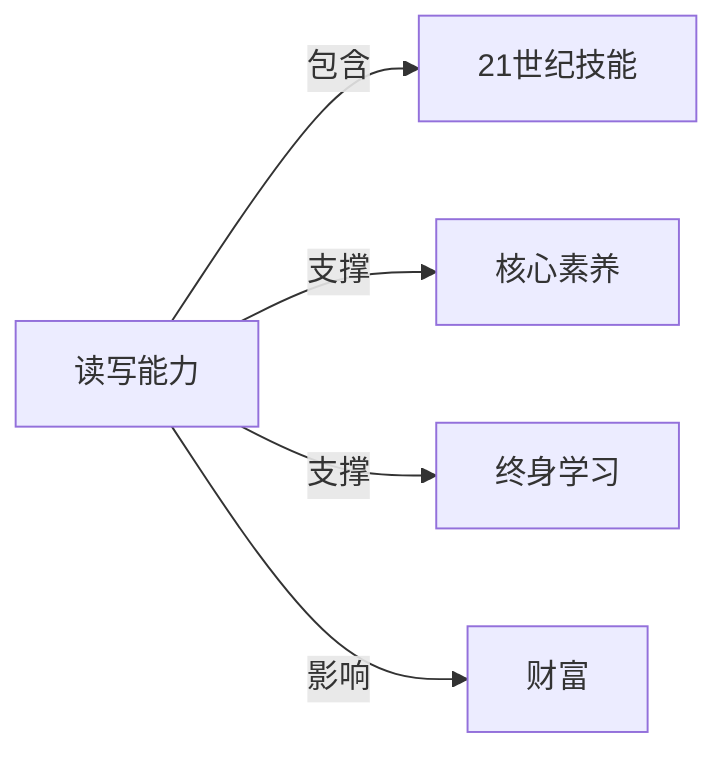

# 读写能力

## 定义
读写能力指理解、评估、运用文本信息并借此有效参与社会交流与终身学习的基础素养，不仅限于识字和书写，更强调功能性、批判性与文化情境中的综合应用。

## 核心解释
传统上读写能力被简单等同于识字和拼写，但现代定义已扩展为“功能性读写”：能读懂说明书、填写表格、解读数据图表；进而延伸到批判性读写，即分析文本背后的观点、偏见和意图；以及多元素养（如数字阅读、跨媒介表达）。其核心边界在于区分“机械解码”与“建构意义”，若只能朗读文字却不理解含义或无法将文本信息迁移到新情境，则未形成真正的读写能力。常见误解是将其仅看作语文课的任务，忽视它在数学、科学、公民参与等各领域中的基础工具属性。

## 示例
- 阅读合同条款并识别其中潜在风险，而非仅签字确认。
- 根据多个网络来源整合信息，撰写一篇有理有据的科普简报，并注明引用。

## 关联概念
- [[21世纪技能]]：读写能力是21世纪技能框架中'信息、媒介与技术素养'以及'沟通与协作'的基础，支撑公民在全球化和数字化环境中有效交流和学习。
- [[核心素养]]：中国学生发展核心素养的文化基础维度中，人文底蕴和科学精神均依赖读写能力对文本的深层次理解与表达，是跨学科素养的根基。
- [[终身学习]]：读写能力是独立获取、筛选和处理信息的关键，直接决定个体能否持续进行有目的的终身自主学习。
- [[财富]]：大量研究表明，较高的读写能力有助于提升就业层次和收入水平，进而影响个人财富积累与社会经济地位。

## 相关问题
- 功能性文盲在现代社会中有哪些具体表现？
- 数字阅读对传统深度阅读能力产生了怎样的冲击和重塑？
- 如何科学评估儿童早期读写能力的发展水平？
- 读写能力与批判性思维之间是什么关系？
- 面向人工智能生成内容时代，人类读写能力的独特价值体现在哪里？

## 关系图

