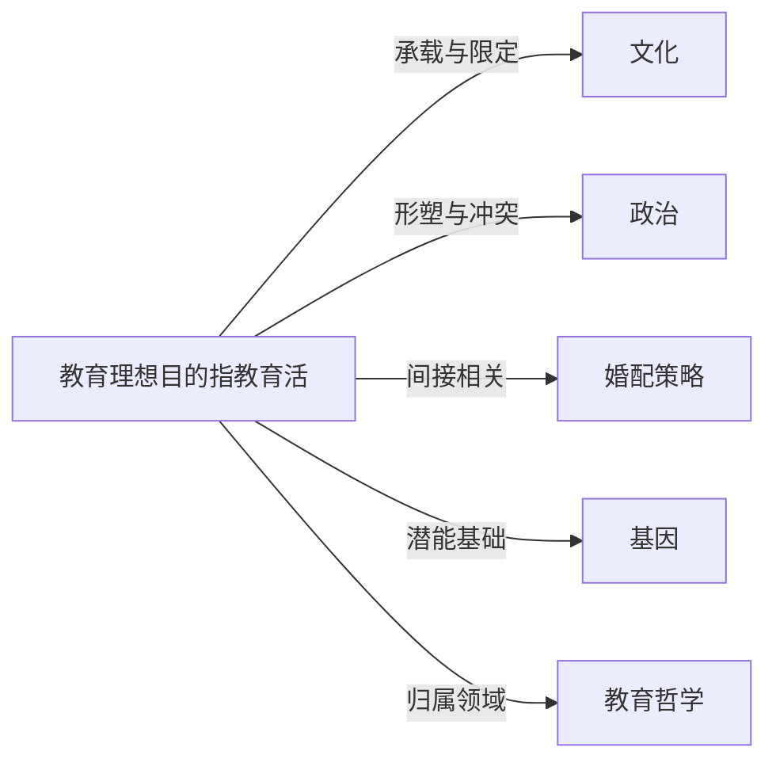

# 教育理想目的

## 定义
教育理想目的指教育活动所追寻的终极性价值目标，是超越具体教学任务、升学与就业指标的关于“培养什么样的人”的根本愿景。

## 核心解释
它关注人的完整发展，强调理性、道德、审美、身体等各方面潜能的和谐实现，兼顾个人幸福与社会进步的统一。其边界在于区别于阶段性、工具性的教育目标（如掌握某一技能、通过考试），理想目的具有规范性、超越性和整合性。常见误解包括：将理想目的等同于国家教育方针中的现成表述，忽视其作为反思性理念对现实的批判功能；或将其误解为一种脱离实际、无法实现的空想，而否认其指引实践方向的必要价值。

## 示例
- 古希腊雅典的“博雅教育”理想，旨在培养身心和谐、理性自主的自由公民。
- 约翰·杜威提出的“教育即生长”，将教育本身视为目的，主张教育不是为未来生活做准备，而是不断扩展经验与智慧的过程。
- 中国儒家传统中的“成人之教”，追求人格完善与“内圣外王”的统一。

## 关联概念
- [[文化]]：教育理想目的总是嵌入特定文化传统，文化为其提供价值内容，也构成其表达的边界。
- [[政治]]：政治权力常试图规定或利用教育目的，而理想目的又可能成为超越特定政治安排、追求人的解放的批判资源。
- [[婚配策略]]：在某些社会分析视角下，教育过程和目的与婚姻市场中的竞争力相关联，理想目的则提供反思这种功利化倾向的规范性参照点。
- [[基因]]：基因构成人的先天禀赋，教育理想目的的实现需要考虑个体遗传差异，但理想目的本身是对基因决定论的超越，强调后天培养的转化力量。
- [[教育哲学]]：教育理想目的属于教育哲学的核心议题，是对教育根本价值的系统省思。

## 相关问题
- 教育的目的应该由谁来定义？
- 当个人发展与社会需求冲突时，教育的理想目的如何调和这种矛盾？
- 功利主义导向的教育目标在多大程度上背离了教育的理想目的？
- 不同文化传统下的教育理想目的是否具有共通性？

## 关系图

