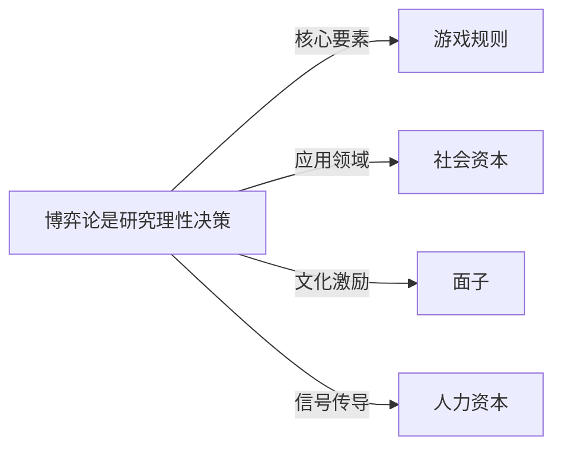

# 博弈论

## 定义
博弈论是研究理性决策者在相互依存情境下进行策略选择与互动的数学理论。

## 核心解释
博弈论的核心内涵是分析多个参与者（个体或组织）在知晓彼此行动会影响各自收益的情况下，如何选择最优策略。关键要素包括参与者、策略集合、收益函数和均衡概念（如纳什均衡）。它不限于零和对抗，也广泛涵盖合作、协调、信号传递等情境。常见误解是将博弈论等同于“尔虞我诈”或仅用于赌博，实际上它为理解市场、政治、生物演化和社会规范提供了一个统一的分析框架，并假设参与者具有共同知识下的理性，行为博弈论则进一步放宽了完全理性假设。

## 示例
- 囚徒困境：两个共谋嫌疑人被分开审讯，如都抵赖则各判1年，如都坦白则各判5年，如一人坦白一人抵赖则坦白者释放、抵赖者判10年，揭示个体理性导致集体非最优结果
- 协调博弈：两位司机在窄路上相遇，都选左或都选右则顺利通过，一左一右则堵塞，阐释共同预期的重要性

## 关联概念
- [[游戏规则]]：博弈论中的游戏规则定义了参与者、可选行动顺序和信息结构，是分析策略互动的起点
- [[社会资本]]：博弈论通过重复博弈和声誉机制解释信任、合作网络等社会资本的形成与维持
- [[面子]]：在演化和文化博弈中，面子可作为维持合作和履行承诺的非物质收益，影响策略选择
- [[人力资本]]：劳动力市场的信号博弈用教育、培训等人力资本投资作为生产力信号，解决信息不对称问题

## 相关问题
- 什么是纳什均衡？它在现实中如何体现？
- 博弈论如何解释合作行为在竞争环境中的出现？
- 零和博弈与非零和博弈的本质区别是什么？
- 行为博弈论对经典博弈论的主要修正有哪些？

## 关系图

