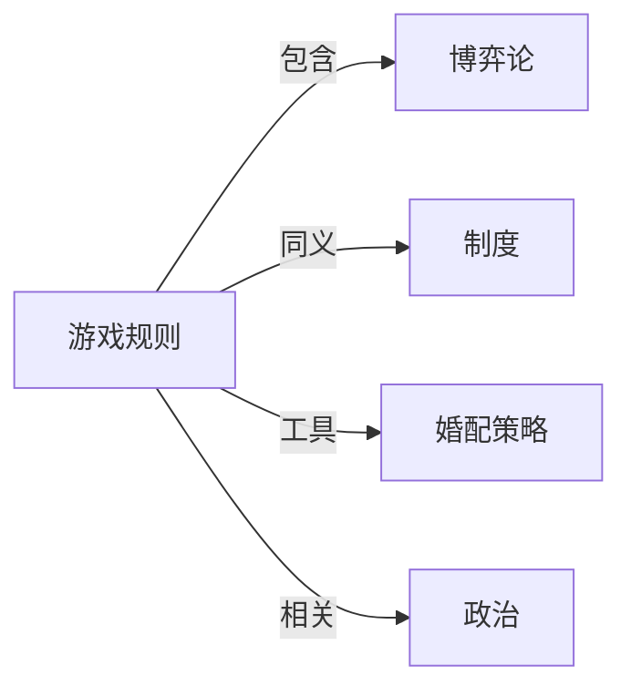

# 游戏规则

## 定义
游戏规则是界定参与者允许采取的行动、禁止的行为以及如何判定结果与奖惩的一系列正式或非正式约定。

## 核心解释
游戏规则为互动划定了边界，明确了哪些策略可行、哪些不可行，以及胜负或给付的判定方式。规则可以是明示的（如棋类规则、体育比赛章程），也可以是隐含的（如社会交往礼仪、市场竞争惯例）。核心在于通过限制选择来产生有意义的结构性互动。常见误解是将规则等同于可随意违反的软约束，或在所有场景下要求规则绝对对称，实际上许多有效的游戏规则本身就包含非对称角色与差异化收益。

## 示例
- 国际象棋中每一棋子的走法和胜负判定
- 拍卖市场中竞拍者必须遵守的出价规则与成交机制
- 职场晋升中不成文的年资与绩效权衡规范

## 关联概念
- [[博弈论]]：博弈论数学化地研究给定游戏规则下理性参与者的策略选择与均衡
- [[制度]]：制度是社会中约束人际互动的正式与非正式游戏规则
- [[婚配策略]]：婚配市场上的行为可视为在文化设定的游戏规则下的择偶博弈
- [[政治]]：政治活动常被喻为在宪法和法律等规则框架下的权力游戏

## 相关问题
- 游戏规则与法律规范的异同是什么？
- 如何设计公平且有趣的游戏规则？
- 博弈论如何预测规则变化导致的策略调整？

## 关系图

