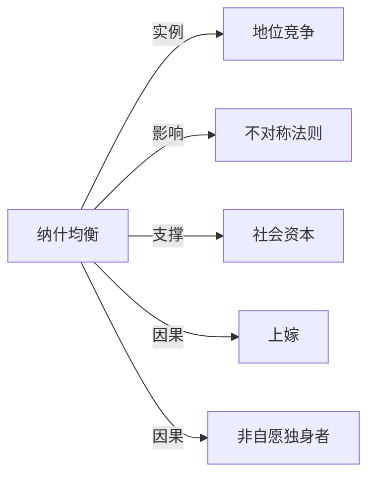

# 纳什均衡

## 定义
在一个博弈中，所有参与者均选择了针对他人策略的最优反应，且无人能通过单方面改变自身策略而获得更好结果的策略组合。

## 核心解释
纳什均衡描述了一种稳定的策略状态，每个玩家的选择都是对其他玩家选择的最优回应。它不是指集体利益最大，也不一定唯一。常见误解是认为均衡一定有效率或公平，实际上可能陷入囚徒困境等低效状态。均衡存在性依赖于有限玩家和混合策略等条件。

## 示例
- 囚徒困境中，双方都选择坦白就构成一个纳什均衡，尽管两人都抵赖会让结果更好。
- 市场上两家企业同时定价，每家都根据对方价格制定最优价格，最终形成的价格组合便是纳什均衡。

## 关联概念
- [[地位竞争]]：地位竞争可建模为协调博弈，纳什均衡解释了为何人们趋同于某些信号竞赛，即使整体福利受损。
- [[不对称法则]]：当参与者资源或权力不对称时，纳什均衡会偏向更强大一方的意愿，形成不对称的稳定结构。
- [[社会资本]]：在重复互动中，社会资本作为信任和声誉的积累，有助于维持合作型纳什均衡，防止背叛。
- [[上嫁]]：婚配偏好和策略互动可形成纳什均衡，例如传统“上嫁”现象可视为特定社会结构下的稳定匹配结果。
- [[非自愿独身者]]：在婚恋博弈中，若某一群体无法形成任何增益的单方面策略变动，则其处境可能是一种非意愿的纳什均衡状态。

## 相关问题
- 纳什均衡一定存在吗？
- 如何打破一个不良的纳什均衡？
- 纳什均衡与帕累托最优有什么区别？
- 现实中有哪些不是纳什均衡但常见的博弈结果？

## 关系图

