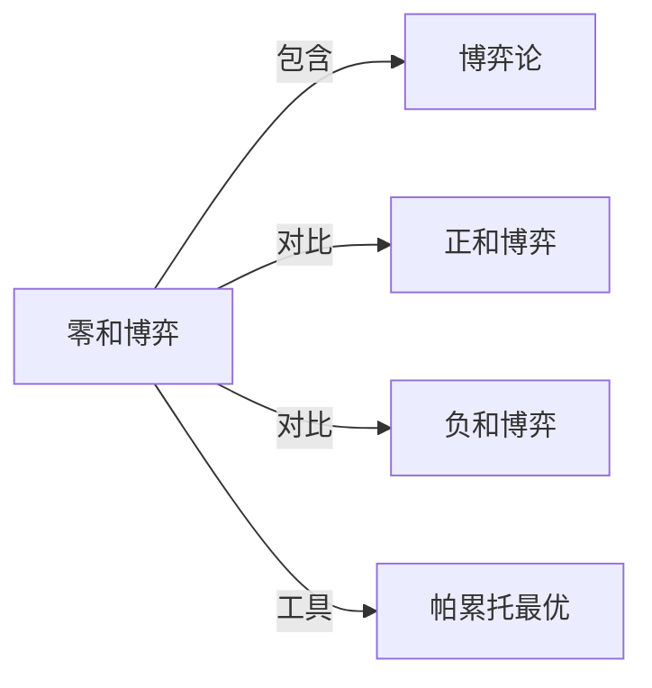

# 零和博弈

## 定义
一种博弈情境，其中一方的收益必然等于另一方的损失，参与者的总收益之和为零。

## 核心解释
核心内涵是利益完全对立：蛋糕大小固定，分割此消彼长。它假设资源或效用不可创造、不可消灭，只在不同主体间转移。边界在于博弈的规则和支付结构必须严格满足总收益守恒；一旦合作能做大蛋糕或行为产生外部收益/损耗，就不再是零和。常见误解是将一切竞争、谈判或利益分配都视为零和，而现实中大量交易、分工与创新属于正和博弈，各方均可能获益。

## 示例
- 两个人分配固定数额的奖金，一人多得则另一人少得。
- 赌博游戏中，在忽略庄家抽水的情况下，赢家赢取的筹码等于输家失去的筹码。

## 关联概念
- [[博弈论]]：零和博弈是博弈论中按支付结构划分的一种基本类型。
- [[正和博弈]]：参与者通过合作或创新使总收益增加，可能出现各方同时获益的结果。
- [[负和博弈]]：博弈过程中总收益减少，各方的损失之和大于收益之和。
- [[帕累托最优]]：零和博弈的任何非帕累托改善的变动都会使至少一方受损，常与帕累托改进对比。

## 相关问题
- 如何判断一个现实情境是零和博弈还是正和博弈？
- 哪些常见的零和思维陷阱会导致错误的决策？
- 零和博弈与负和博弈的边界在哪里？

## 关系图

