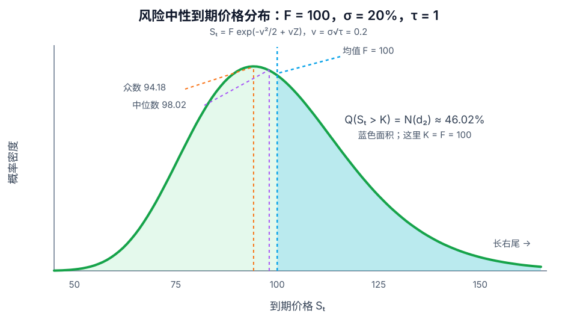

# 对数正态分布

## 定义

若正随机变量 $X$ 的自然对数服从正态分布，

$$
\ln X\sim\mathcal N(m,v^2),\qquad v>0,
$$

则称 $X$ 服从参数为 $(m,v^2)$ 的对数正态分布，记作

$$
X\sim\operatorname{Lognormal}(m,v^2).
$$

其概率密度为

$$
f_X(x)=
\frac{1}{xv\sqrt{2\pi}}
\exp\!\left[-\frac{(\ln x-m)^2}{2v^2}\right],
\qquad x>0.
$$

参数 $m$ 与 $v$ 是 $\ln X$ 的均值和标准差，**不是** $X$ 本身的均值和标准差。

## 形状与位置

*示例取风险中性远期价 $F=100$、年化波动率 $\sigma=20\%$、期限 $\tau=1$。分布仅支持 $S_T>0$，并具有长右尾。*

对数正态分布通常右偏，其均值、中位数与众数分别为

$$
\mathbb E[X]=e^{m+v^2/2},
\qquad
\operatorname{Median}(X)=e^m,
\qquad
\operatorname{Mode}(X)=e^{m-v^2},
$$

因此

$$
\operatorname{Mode}(X)
<\operatorname{Median}(X)
<\mathbb E[X].
$$

方差为

$$
\operatorname{Var}(X)
=\left(e^{v^2}-1\right)e^{2m+v^2}.
$$

## 与 Black–Scholes 的关系

在常数利率 $r$、连续股息率 $q$ 和波动率 $\sigma$ 的基本 Black–Scholes–Merton 模型中，风险中性测度 $\mathbb Q$ 下的标的价格满足

$$
dS_u=(r-q)S_u\,du+\sigma S_u\,dW_u^{\mathbb Q}.
$$

令剩余期限 $\tau=T-t$、远期价格 $F=S_t e^{(r-q)\tau}$、期限波动率 $v=\sigma\sqrt{\tau}$，则

$$
S_T
=F\exp\!\left(-\frac{v^2}{2}+vZ\right),
\qquad Z\sim\mathcal N(0,1),
$$

所以

$$
\ln S_T
\sim
\mathcal N\!\left(\ln F-\frac{v^2}{2},v^2\right),
$$

而 $S_T$ 在 $\mathbb Q$ 下服从对数正态分布。特别地，

$$
\mathbb E^{\mathbb Q}[S_T]=F,
\qquad
\operatorname{Median}(S_T)=Fe^{-v^2/2},
\qquad
\operatorname{Mode}(S_T)=Fe^{-3v^2/2}.
$$

远期价格 $F$ 是风险中性算术均值，不是分布峰值，也不是“最可能的到期价格”。

## 从分布到期权价格

对行权价 $K$，定义

$$
d_1=\frac{\ln(F/K)+\tfrac12v^2}{v},
\qquad
d_2=d_1-v
=\frac{\ln(F/K)-\tfrac12v^2}{v}.
$$

欧式看涨期权价格可写为

$$
C=e^{-r\tau}\left[F N(d_1)-K N(d_2)\right].
$$

其中 $N(\cdot)$ 是[[正态分布|标准正态累积分布函数]]。在同一风险中性分布下，

$$
N(d_2)=\mathbb Q(S_T>K),
$$

即看涨期权到期价内的模型概率；$N(d_1)$ 则是标的支付项的加权因子，不能把两者都解释为到期价内概率。

## 精确区间与常见误区

- 因为正态性存在于 $\ln S_T$，68.27% 中央价格区间是

$$
\left[
Fe^{-v^2/2-v},
Fe^{-v^2/2+v}
\right],
$$

  而不是简单地在 $F$ 两侧加减 $Fv$。
- 风险中性分布用于定价，并不是现实世界收益预测；在现实测度下，漂移一般不等于 $r-q$。
- 常数波动率的 Black–Scholes 模型给出单一对数正态分布。市场中的波动率偏斜、肥尾、跳跃和波动率聚集说明该假设只是基准近似。

## 关联概念

- [[正态分布]]：对数正态变量的自然对数服从正态分布。
- [[波动率]]：$\sigma$ 是年化对数收益波动率，$v=\sigma\sqrt\tau$ 是期限内对数收益标准差。
- [[Knowledge/Concepts/经济/金融/衍生品/期权/References/Option Volatility and Pricing 双语版/Black–Scholes 模型 The Black-Scholes Model|Black–Scholes 模型]]：以风险中性对数正态终端分布为定价基准。
- [[肥尾分布]]：现实收益的尾部风险通常高于单一正态或对数正态模型的预测。

## 相关问题

- 为什么 $N(d_1)$ 与 $N(d_2)$ 的经济含义不同？
- 波动率偏斜如何改变 Black–Scholes 的单一对数正态分布假设？

## 来源

- [[Knowledge/Concepts/经济/金融/衍生品/期权/References/Option Volatility and Pricing 双语版/Black–Scholes 模型 The Black-Scholes Model#n(x) 与 N(x) / n(x) and N(x)|Natenberg：Black–Scholes 模型中的正态与对数正态分布]]
