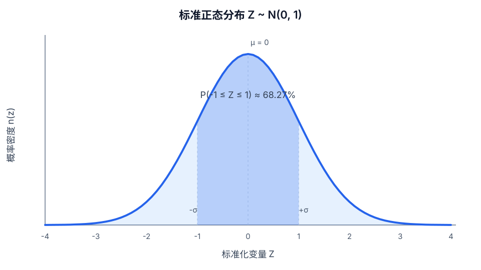

# 正态分布

## 定义
正态分布是由均值 $\mu$ 和方差 $s^2$ 决定的连续概率分布。若

$$
X\sim\mathcal N(\mu,s^2),\qquad s>0,
$$

则其概率密度为

$$
f_X(x)=\frac{1}{s\sqrt{2\pi}}
\exp\!\left[-\frac{(x-\mu)^2}{2s^2}\right],
\qquad -\infty<x<\infty.
$$

这里用 $s$ 表示一般正态分布的标准差，以免与期权模型中的年化波动率 $\sigma$ 混淆。

*标准正态分布 $Z\sim\mathcal N(0,1)$。曲线高度是概率密度，区间下的面积才是概率。*

## 核心解释
正态分布关于均值对称；均值决定位置，标准差决定离散程度。连续型随机变量落在某个单点的概率为 $0$，因此图上曲线的高度不能直接读作概率。

将 $X$ 标准化后得到

$$
Z=\frac{X-\mu}{s}\sim\mathcal N(0,1).
$$

标准正态密度与累积分布函数常分别记作

$$
n(z)=\frac{1}{\sqrt{2\pi}}e^{-z^2/2},
\qquad
N(z)=\Phi(z)=\int_{-\infty}^{z}n(u)\,du.
$$

正态分布的经典区间概率为

$$
\Pr(|Z|\le 1)\approx68.27\%,\qquad
\Pr(|Z|\le 2)\approx95.45\%,\qquad
\Pr(|Z|\le 3)\approx99.73\%.
$$

经典金融模型通常假设**连续复利收益（对数收益）**服从正态分布，由此推出价格服从[[对数正态分布]]。这不等同于“价格服从正态分布”；后者会给负价格分配正概率。

## 示例
- 标准正态分布满足 $\mu=0$、$s=1$。
- [[Knowledge/Concepts/经济/金融/衍生品/期权/References/Option Volatility and Pricing 双语版/Black–Scholes 模型 The Black-Scholes Model|Black–Scholes 模型]]使用标准正态累积分布函数 $N(\cdot)$ 构造定价权重；在模型假设下，$N(d_2)$ 是风险中性价内概率，而不是现实世界预测概率。

## 关联概念
- [[标准差]]：标准差控制正态分布的尺度。
- [[对数正态分布]]：变量取对数后服从正态分布；Black–Scholes 的到期价格假设属于这一类。
- [[波动率]]：收益率标准差常被解释为波动率。
- [[期权]]：经典期权模型依赖收益分布假设。

## 相关问题
- 正态分布与对数正态分布有什么区别？
- 肥尾如何影响深度价外期权的估值？

## 来源
- [[Knowledge/Concepts/经济/金融/衍生品/期权/References/Option Volatility and Pricing 双语版/知识图谱/概率分布|Natenberg 期权知识图谱：概率分布]]
