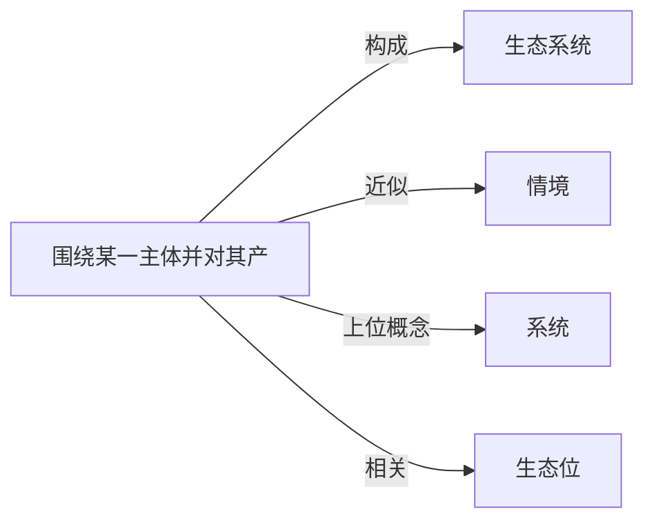

# 环境

## 定义
围绕某一主体并对其产生影响的周围事物、条件或状况的总和。

## 核心解释
环境是一个相对于中心事物而言的相对概念，其边界取决于所关注的主体：可以是个人、种群、组织、系统乃至一种思想。环境既包括自然要素（如气候、地形、生物），也包括社会、文化、制度等构建性要素。常见误解是将环境等同于纯粹的“自然环境”，忽略了其社会、信息和心理等维度；另一个误区是认为环境是静态外部背景，实际上环境与主体之间往往存在持续的相互作用、相互塑造。

## 示例
- 在生态学中，一种动物的环境包括其所在的栖息地、食物、天敌和气候条件。
- 在组织管理中，企业环境包含市场、法规、技术趋势和竞争对手。

## 关联概念
- [[生态系统]]：自然环境的核心结构，由生物群落与无机环境相互作用的系统，是环境概念的生态学具体化。
- [[情境]]：更倾向于行动发生时的即时社会心理背景，是环境在具体时刻的切片。
- [[系统]]：环境常被看作系统的外部条件，系统论严格区分系统与它的环境。
- [[生态位]]：从主体角度出发的、其所利用和适应的具体环境维度总和，将环境与主体的角色关联起来。
- [[进化生物学]]：环境通过选择性压力塑造生物表型与基因频率，是进化发生的外部条件。
- [[经济增长]]：经济增长常常以自然资源消耗和环境质量退化为代价，引出可持续发展议题。
- [[天赋]]：天赋代表先天因素，环境代表后天培养与外部条件，二者交互决定能力发展。
- [[玩家]]：玩家存在于环境之中，环境的规则、资源和约束塑造了玩家的可行行动空间。

## 相关问题
- 什么是“环境决定论”及其主要批评？
- 环境承载力如何影响人口与资源的关系？
- 制度环境与非正式制度如何影响个体行为？

## 关系图

