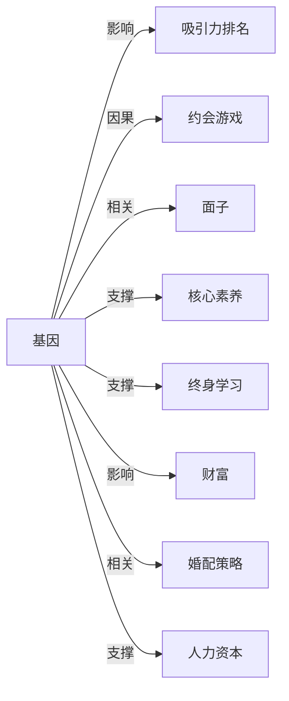

# 基因

## 定义
基因是携带生物遗传信息的基本功能单位，通常是一段编码蛋白质或功能RNA的DNA序列。

## 核心解释
基因通过指导蛋白质合成来决定生物体的性状与功能，是遗传信息传递的核心载体。其关键内涵包括：基因位于染色体上，具有特定的位点；不同个体间同一基因的变异形式称为等位基因，是遗传多样性的来源。边界在于，基因并非唯一决定因素，多数性状由基因与环境共同作用。常见误解有：认为一个基因只决定一种性状（实际多为多基因影响），或认为基因决定一切（忽视表观遗传与环境）。

## 示例
- 乳糖酶基因（LCT）的变异导致成年后乳糖耐受或乳糖不耐受。
- BRCA1基因突变显著增加乳腺癌和卵巢癌风险。

## 关联概念
- [[吸引力排名]]：基因通过影响外貌、身体对称性与健康信号，在吸引力评判中起基础作用。
- [[约会游戏]]：进化中形成的择偶偏好受基因驱动，影响约会中的行为策略与选择。
- [[面子]]：基因影响能力、健康与外貌，从而影响个体社会地位与面子获取。
- [[核心素养]]：基因提供了认知、性格等生物基础，与后天教育共同塑造核心素养。
- [[终身学习]]：学习能力部分受基因影响，构成终身学习的生理潜能边界。
- [[财富]]：基因可能通过影响认知、风险偏好等间接关联财富积累。
- [[婚配策略]]：婚配策略的终极目标是基因传递，择偶偏好实质上是为筛选优质基因或适应性基因载体服务的心理机制。
- [[人力资本]]：基因影响个体的基本认知潜能、性格特质和健康基础，构成人力资本积累的先天起点。

## 相关问题
- 基因检测能预测我的未来疾病吗？
- 基因编辑技术（如CRISPR）的伦理边界在哪里？
- 性格和智商在多大程度上由基因决定？
- 表观遗传如何让环境因素影响基因表达？

## 关系图

