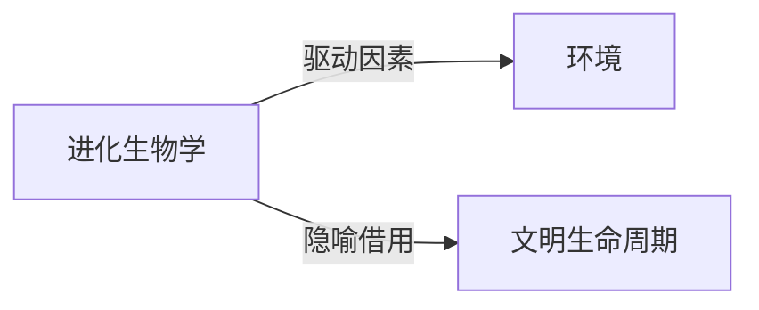

# 进化生物学

## 定义
进化生物学是研究生物种群在世代间遗传特征变化及新物种形成机制的科学。

## 核心解释
进化生物学的核心在于解释生命多样性和统一性，通过自然选择、遗传漂变、基因流和突变等机制，理解种群基因频率的跨代改变。它强调种群作为进化单位，而非个体；进化没有预设方向，不必然走向“高等”或复杂化。常见误解包括将进化等同于“进步”、认为个体在其一生中会进化、或混淆进化与物种起源的单一事件。现代综合进化论整合了达尔文自然选择与孟德尔遗传学，并已扩展至分子进化和发育进化领域。

## 示例
- 达尔文雀喙形状随干旱引起的食物类型变化而快速演变
- 细菌在抗生素压力下产生耐药性，成为种群水平的进化实例
- 鲸类祖先由陆生重返海洋，展现渐进的形态与生理适应

## 关联概念
- [[环境]]：环境通过选择性压力塑造生物表型与基因频率，是进化发生的外部条件。
- [[文明生命周期]]：文明生命周期常借用进化生物学的兴起、适应与衰退模型，但文明演化并非严格生物进化。

## 相关问题
- 进化与自然选择有什么区别？
- 进化是否意味着生物总是变得更复杂或更高级？
- 基因漂变和自然选择在进化中的作用有何不同？

## 关系图

