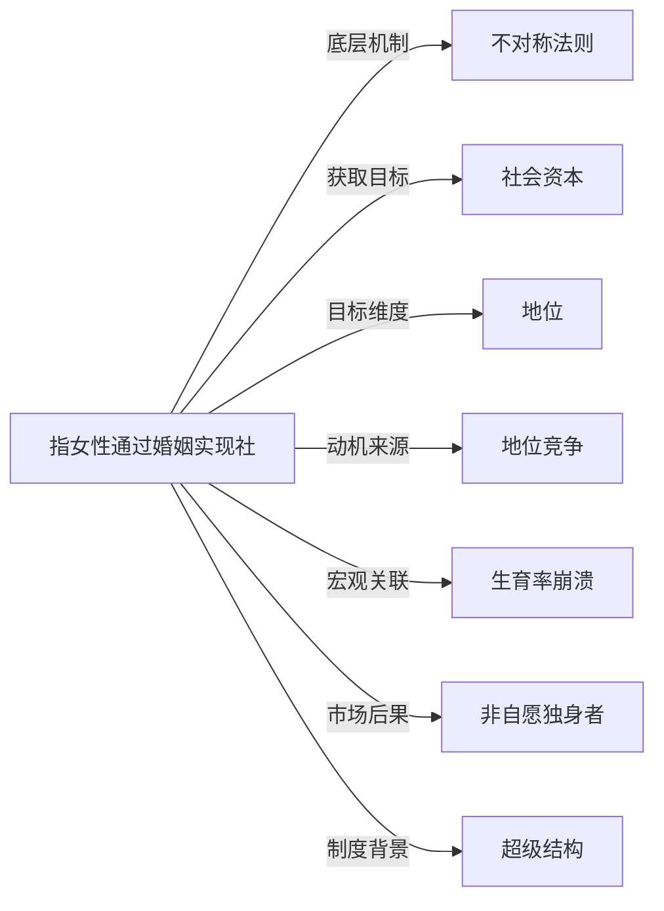

# 上嫁

## 定义
指女性通过婚姻实现社会经济地位向上流动的现象与策略。

## 核心解释
“上嫁”源于婚配梯度原则，即女性倾向于选择社会地位、收入、教育水平高于自己的男性作为配偶。在社会交换视角下，女性将自身的年轻、外貌、生育能力等资源与男性向上提供的经济资源和社会资本进行交换，从而突破原有阶层。该概念常被误解为纯粹的功利婚姻，但实践中上嫁往往混合了情感与理性计算。其边界在于：上嫁强调方向性（向上），不同于平嫁或下迁婚；并非所有阶层提升的婚姻都出于明确的上嫁策略，也可能是个体匹配中的自然梯度表现。

## 示例
- 出身普通家庭的女性与高收入专业人士结婚，进入中产生活圈层。
- 在严格等级社会中，平民女性通过与贵族联姻获得家族地位提升。

## 关联概念
- [[不对称法则]]：上嫁是婚配中资源不对称交换的典型表现，女性以非经济资本交换男性的经济与社会资本。
- [[社会资本]]：上嫁不仅获取物质资源，更常带来社会关系网络的跃迁，即社会资本的积累。
- [[地位]]：上嫁的核心驱动力是提升微观层面的家庭地位与宏观层面的社会分层位置。
- [[地位竞争]]：上嫁可被视为一种间接的地位竞争策略，女性通过配偶的地位来强化自身及后代的社会竞争起点。
- [[生育率崩溃]]：当大量女性追求上嫁、推迟婚育，或者高阶层男性资源相对稀缺时，可能造成整体婚配市场紧缩，成为生育率下降的因素之一。
- [[非自愿独身者]]：婚配梯度的普遍存在使得处于社会经济底层的男性被挤压出婚姻市场，可能转化为非自愿独身者。
- [[超级结构]]：超级结构所代表的系统性社会不平等与阶层固化，既制造了上嫁的动力，也限定了上嫁可能实现的通道与天花板。
- [[约会游戏]]：约会游戏中的价值匹配以上嫁为核心动力之一，女性通常寻求社会地位或财富不低于自己的配偶。

## 相关问题
- 上嫁策略在当代社会中是否依然有效，遇到了哪些结构性阻碍？
- 如何区分健康的上嫁婚配与导致权力严重失衡的剥削性交易？
- 男性是否存在类似“上娶”的婚配梯度现象，其机制有何不同？
- 上嫁普遍化的社会对性别角色和女性独立会产生何种长期影响？

## 关系图

