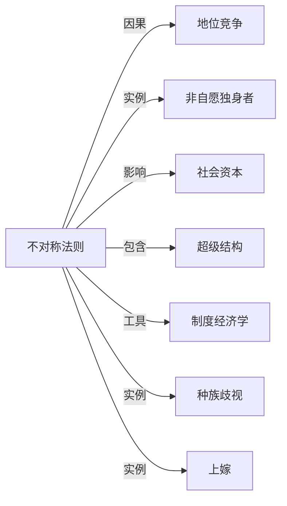

# 不对称法则

## 定义
一种社会性分配规律，指在资源、机会或关注度的竞争中，初始优势倾向于自我强化，导致结果呈少数占据多数、强者愈强的结构性不对称。

## 核心解释
不对称法则刻画的是非线性正反馈机制：微小初始差异在累积过程中被放大，形成幂律分布或‘胜者通吃’局面。它区别于一次性的比例失衡，强调系统性、自我维持的不平等。常见误解是将其完全归因于个人能力或道德品质，而忽视制度设计和网络效应对它的塑形作用。该法则广泛见于地位竞争、资本积累、信息传播等领域，与马太效应、帕累托法则在逻辑上同源，但更强调不对称如何被结构锁定。

## 示例
- 婚恋市场中，少部分高地位、高社会资本的男性获得大部分女性积极关注，大量低地位男性沦为‘非自愿独身者’，构成地位的极端不对称分布。
- 社交媒体平台上，极少数头部账号占据绝大多数流量和广告收益，长尾创作者所得甚微，反映出注意力经济中的不对称法则。

## 关联概念
- [[地位竞争]]：不对称法则是地位竞争可能产生的极端结果形态，竞争越激烈、反馈越强，不对称越显著。
- [[非自愿独身者]]：不对称法则在性和浪漫关系领域的直接体现，部分男性因在该法则下落入尾端而难以建立亲密关系。
- [[社会资本]]：社会资本的不对称分布既是该法则的结果，又作为杠杆进一步强化原有的不对称，形成循环累积。
- [[超级结构]]：已经形成的超级结构会利用不对称法则保护顶层优势，使流动性降低、不均衡常态化为结构。
- [[制度经济学]]：制度经济学分析正式与非正式规则如何塑造不对称法则的产生与延续，例如产权、交易成本对累积优势的影响。
- [[种族歧视]]：系统性种族歧视是一种人为建立并维护的不对称法则，使特定族群长期处于资源与机会分配的弱势一端。
- [[上嫁]]：上嫁是婚配中资源不对称交换的典型表现，女性以非经济资本交换男性的经济与社会资本。

## 相关问题
- 不对称法则与马太效应的主要差异是什么？
- 哪些机制可以减缓或打破不对称法则的正反馈循环？
- 在地位竞争中，个体如何识别并应对不对称法则带来的结构性劣势？
- 制度设计如何在不摧毁竞争激励的前提下，避免不对称法则走向极端固化？

## 关系图

