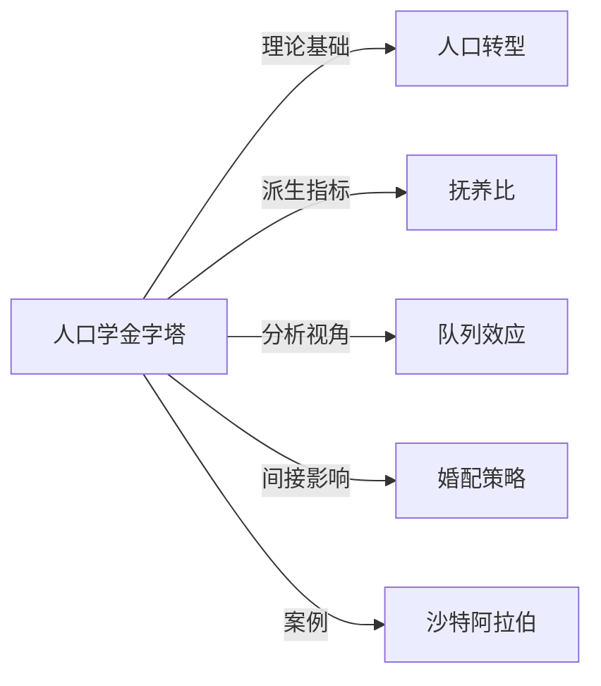

# 人口学金字塔

## 定义
人口学金字塔是按年龄和性别划分的人口分布图示，也称年龄-性别金字塔，直观展示人口结构类型。

## 核心解释
人口学金字塔纵轴表示年龄分组（从底部的低龄到顶部的高龄），横轴分别表示男性和女性的绝对人口数或占总人口百分比。其形状反映出生率、死亡率和迁移对年龄结构的长期影响。常见误解是认为金字塔形状只由生育率决定，实际上死亡率改善、寿命延长和历史人口事件同样塑造其轮廓。边界上，它侧重于人口存量的静态截面，不直接显示生育率或迁移流。形状一般分为扩张型（宽底尖顶，增长型）、收缩型（底部变窄，静止或缩减型）和稳定型（接近矩形）。

## 示例
- 撒哈拉以南非洲国家的扩张型金字塔：底部大量儿童，顶部收窄，显示出高生育率和较高的年轻人口比例。
- 日本和意大利等国家的收缩型金字塔：中上部较宽，底部较窄，反映了长期的低生育率和人口老龄化。
- 卡塔尔等移民劳动力输入国的年龄-性别金字塔：年轻劳动年龄男性大量集中，呈现明显的性别不对称。

## 关联概念
- [[人口转型]]：人口转型模型描述出生率和死亡率从高到低的过程，直接决定金字塔形状的演变阶段。
- [[抚养比]]：从金字塔中计算出的非劳动年龄人口与劳动年龄人口之比，用于衡量人口负担程度。
- [[队列效应]]：特定出生队列在不同年龄阶段经历的历史事件（如战争、饥荒）会在金字塔上留下缺口或隆起。
- [[婚配策略]]：在部分社会中，生育行为与婚配模式相关，可影响性别间年龄构成及金字塔部分年龄组的比例。
- [[沙特阿拉伯]]：典型石油经济依赖外籍劳工的国家，其金字塔因大量男性劳动力迁入而呈现性别严重失衡的形态。

## 相关问题
- 扩张型人口金字塔对应的社会经济特征有哪些？
- 战争或瘟疫等事件如何在人口金字塔上留下长期印记？
- 人口金字塔由收缩型向倒置型转变对养老金体系意味着什么？
- 性别选择性生育如何扭曲人口金字塔的性别平衡？

## 关系图

