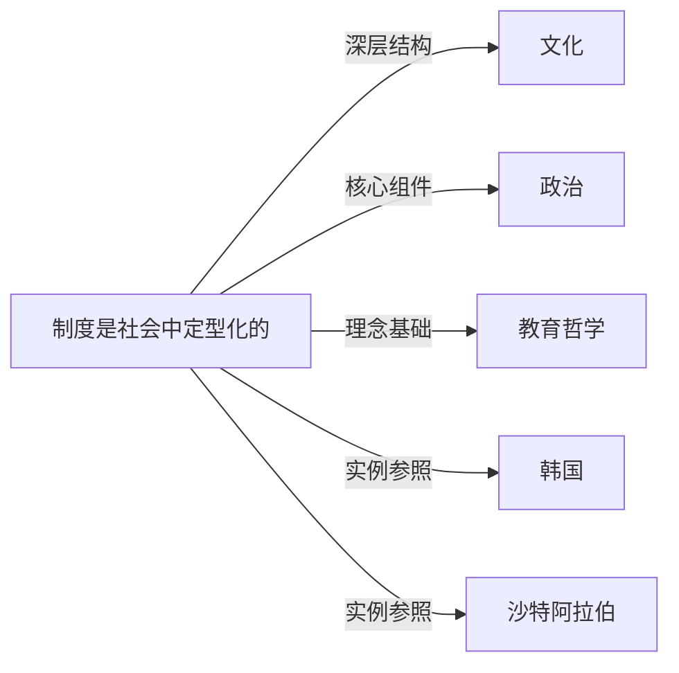

# 制度

## 定义
制度是社会中定型化的、由规则和规范构成的行为模式与组织结构，用以协调和约束个体及集体的行动，降低不确定性。

## 核心解释
制度的核心是提供稳定预期和秩序，既包括法律、规章、契约等正式制度，也包括习俗、惯例、道德等非正式制度。它不等同于具体的组织（如学校、法院），组织是制度的载体和执行者。制度规定了哪些行为被允许、禁止或鼓励，并通过激励和惩罚机制维系。常见的误解是将制度僵化地等同于成文规则，而忽略其动态演化和非正式层面。

## 示例
- 婚姻与家庭制度：规定配偶关系、财产继承、子女抚养等权利与义务
- 市场经济制度：包含产权、合同、竞争规则及相应的法律与习俗支持

## 关联概念
- [[文化]]：文化是制度的精神内核与意义来源，制度则是文化的结构化表达，两者相互塑造。
- [[政治]]：政治制度（如政体、选举规则）是制度中分配权力和决策权的核心部分。
- [[教育哲学]]：教育制度的设计（如学制、选拔机制）背后常隐含着特定的教育哲学取向。
- [[韩国]]：韩国的制度设计，例如其经济转型中的产业政策、教育制度，是制度分析的常见案例。
- [[沙特阿拉伯]]：沙特阿拉伯的君主制和以伊斯兰教法为基础的法律制度，展示了制度与宗教、传统的深度嵌入。

## 相关问题
- 制度如何影响个人行为和选择？
- 正式制度与非正式制度在何种条件下可能发生冲突或互补？
- 制度变迁通常由哪些因素驱动？
- 文化差异如何导致相同制度在不同国家的效果不同？

## 关系图

