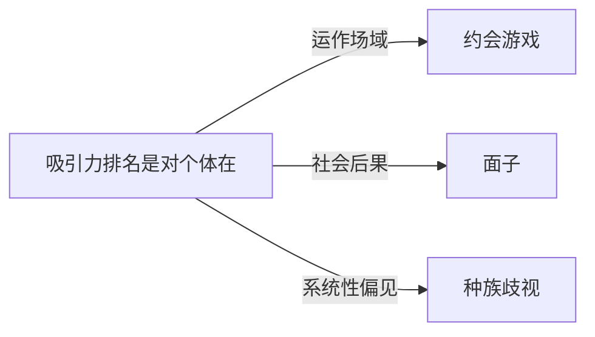

# 吸引力排名

## 定义
吸引力排名是对个体在特定社交环境（如约会市场、职场或社群）中被他人感知的总体吸引力水平所作的比较性排序。

## 核心解释
吸引力排名反映的并非客观特质，而是一种主观的社会评价结果，常综合了外貌、性格、社会地位、资源等显性或隐性指标。其核心内涵是“排序”而非“吸引力”本身，因而天然带有相对性和竞争性。边界上，它与自尊、自我价值感等内在体验不同，是一种外部赋予的等级化标签。常见误解是将排名绝对化，以为存在唯一、固定的吸引力层级；实际上排名高度依赖评价群体的文化背景、性别比例、情境目标和个体偏好，且容易被种族、阶层等结构性偏见污染。

## 示例
- 在一所高中里，学生私下根据外貌和受欢迎程度形成的“校花/校草”非正式排名。
- 线上约会应用中，平台算法根据用户被右滑（点赞）的频率生成的隐性魅力评分与匹配优先级。

## 关联概念
- [[约会游戏]]：约会游戏是吸引力排名最典型的呈现和竞争场所，参与者通过策略行为试图提升自己在他人感知中的排名。
- [[面子]]：吸引力排名的高低直接影响到个体面子的得失，高排名带来社会认同，低排名可能导致丢面子。
- [[种族歧视]]：种族歧视等结构性偏见会系统性地压低某些群体的吸引力排名，使排名的“公正性”成为一种幻象。

## 相关问题
- 吸引力排名在多大程度上影响个体的长期亲密关系质量？
- 如何区分基于健康审美的偏好与构成歧视的排斥性排名？
- 在数字约会平台上，算法如何固化和扭曲现实中的吸引力排名？

## 关系图

