# 地位

## 定义
地位指个体或群体在社会结构中所占据的相对位置，通常伴随特定的权利、义务、声望和资源获取能力。

## 核心解释
地位是社会分层与互动的核心概念，分为先赋地位（如性别、种族、家庭出身）和自致地位（如职业、教育成就）。它不仅是客观的等级排序，还包含社会评价和主观认同。常见误解是将地位等同于财富或权力，其实它涵盖声望、生活方式等维度，且在不同场域中可转换。地位高低影响个体的自尊、机会与社会资本。

## 示例
- 医生职业在现代社会享有较高职业地位，伴随高收入和尊重，属于典型的自致地位。
- 在种姓制度中，出身决定个人终身无法改变的地位，是极端的先赋地位。

## 关联概念
- [[地位竞争]]：个体或群体为提升或维持社会位置而展开的对抗性互动，是地位动态变化的基本机制。
- [[财富]]：经济资源是决定地位的关键因素之一，但地位不等于财富，还包括教育、职业和品味等文化资本。
- [[超级结构]]：地位镶嵌在阶级、性别、种族等宏观社会结构中，超级结构塑造地位分配的基本格局。
- [[种族歧视]]：通过制度或偏见将某些群体固定在低地位，阻断地位提升通道，是一种基于先赋特征的压迫。
- [[非自愿独身者]]：部分男性因在婚恋市场中的性地位缺失而产生挫败与怨恨，地位焦虑可能转向极端认同。
- [[制度经济学]]：该领域研究制度如何影响社会分层与地位分配，比如产权、契约和规范对地位结构的塑造。
- [[生育率]]：社会经济地位与生育率通常呈负相关，高地位群体倾向于少生精养，影响人口结构与阶层再生产。
- [[社会资本]]：社会资本可以转化为地位，高地位者也更易积累社会资本。
- [[亿万富翁]]：亿万富翁身份是经济地位高度可见的终极象征，可直接转化为社会尊重与话语权。

## 相关问题
- 地位与权力、阶级是什么关系？如何区分？
- 先赋地位在多大程度上能被自致地位改变？
- 地位焦虑如何影响现代人的心理健康与消费行为？
- 社交媒体如何重塑地位的展示和竞争方式？

## 关系图

```mermaid
graph LR
    地位指个体或群体在社 -->|核心过程| 地位竞争
    地位指个体或群体在社 -->|相关维度| 财富
    地位指个体或群体在社 -->|宏观框架| 超级结构
    地位指个体或群体在社 -->|扭曲机制| 种族歧视
    地位指个体或群体在社 -->|地位后果| 非自愿独身者
    地位指个体或群体在社 -->|分析视角| 制度经济学
    地位指个体或群体在社 -->|跨代影响| 生育率
```

