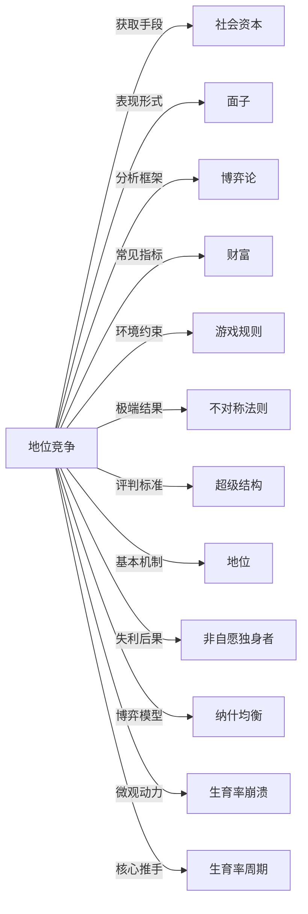

# 地位竞争

## 定义
个体或群体为在社会层级中争取更高位置、声望或影响力而进行的竞争性互动过程。

## 核心解释
地位竞争普遍存在于各种社会结构中，其核心是对相对排序的争夺，而非绝对资源的获取。地位本身是一种关系性存在，依赖于他人的认可与比较。它可以通过展示能力、积累财富、遵守或重塑社交规范、获得荣誉等方式进行。关键边界在于：地位竞争不同于单纯追求生存资源，它更侧重符号性的排序与尊重。常见误解是将地位等同于财富，实际上财富只是获取地位的手段之一；另一误解是认为地位竞争总是零和的，在动态复杂系统中，地位层级可以更替或重新定义。

## 示例
- 学术领域中研究人员争相在顶级期刊发表论文以获取同行认可和学术声望。
- 社交圈中人们通过展示品味、人脉或帮助他人来提升自己在朋友圈中的受尊重程度。

## 关联概念
- [[社会资本]]：社会网络与互惠规范可转化为声望与影响力，是地位竞争的重要资源。
- [[面子]]：在东方文化中，面子是公众对个人社会地位的即时感知，维护和挣得面子是地位竞争的常见表现。
- [[博弈论]]：地位竞争常涉及多人策略互动，可以用博弈论中的信号传递、声望博弈等模型来理解。
- [[财富]]：财富往往作为高地位的信号和奖励，但只是地位竞争中诸多筹码的一种。
- [[游戏规则]]：任何地位竞争都在特定规则下进行，这些规则定义了何种行为能换来地位，并影响竞争的激烈程度和形式。
- [[不对称法则]]：不对称法则是地位竞争可能产生的极端结果形态，竞争越激烈、反馈越强，不对称越显著。
- [[超级结构]]：超级结构提供了地位高低的评判标准和正当化话语，从而使地位竞争在特定轨道上展开。
- [[地位]]：个体或群体为提升或维持社会位置而展开的对抗性互动，是地位动态变化的基本机制。
- [[非自愿独身者]]：部分理论认为，在性别地位和资源竞争中失利、无法达到婚恋市场期望地位的男性更易陷入非自愿独身困境。
- [[纳什均衡]]：地位竞争可建模为协调博弈，纳什均衡解释了为何人们趋同于某些信号竞赛，即使整体福利受损。
- [[生育率崩溃]]：激烈的教育和工作地位竞争抬高了养育孩子的实际成本与心理期待，促使许多人推迟或放弃生育，构成生育率崩溃的核心微观动力
- [[生育率周期]]：地位竞争迫使个体将大量资源投入地位信号与防御，挤压生育意愿，是生育率下行周期的核心推手。

## 相关问题
- 地位竞争与资源竞争的根本区别是什么？
- 在数字化社会中，新的地位竞争渠道和标志有哪些？
- 地位竞争过度对个人心理健康和社会合作有何负面影响？
- 如何识别并摆脱单纯由地位焦虑驱动的虚假竞争？

## 关系图

