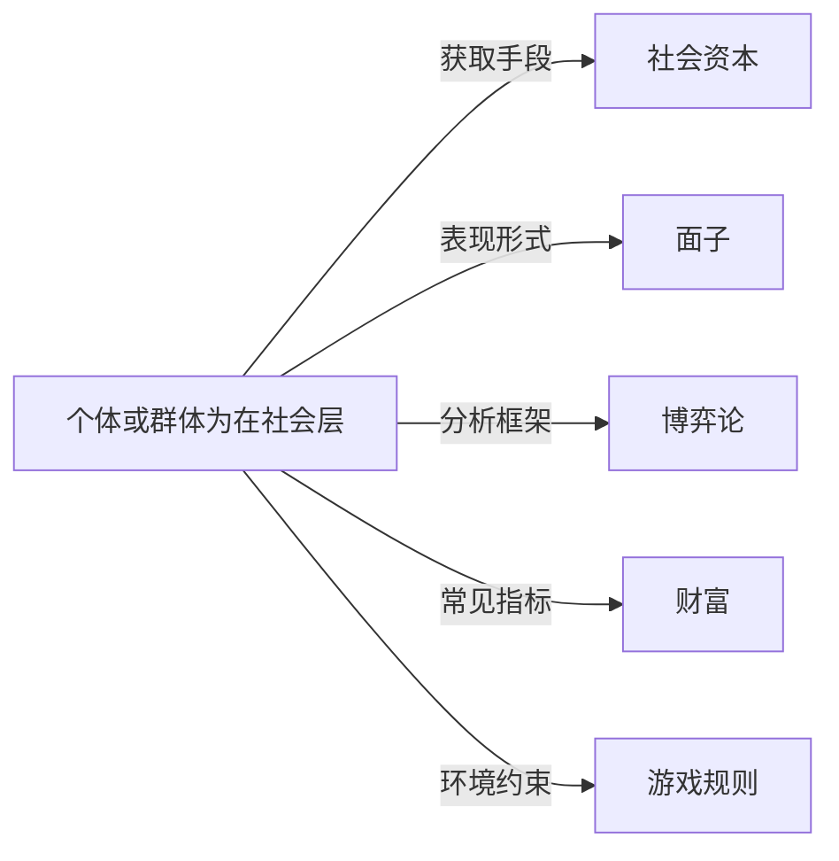

# 地位竞争

## 定义
个体或群体为在社会层级中争取更高位置、声望或影响力而进行的竞争性互动过程。

## 核心解释
地位竞争普遍存在于各种社会结构中，其核心是对相对排序的争夺，而非绝对资源的获取。地位本身是一种关系性存在，依赖于他人的认可与比较。它可以通过展示能力、积累财富、遵守或重塑社交规范、获得荣誉等方式进行。关键边界在于：地位竞争不同于单纯追求生存资源，它更侧重符号性的排序与尊重。常见误解是将地位等同于财富，实际上财富只是获取地位的手段之一；另一误解是认为地位竞争总是零和的，在动态复杂系统中，地位层级可以更替或重新定义。

## 示例
- 学术领域中研究人员争相在顶级期刊发表论文以获取同行认可和学术声望。
- 社交圈中人们通过展示品味、人脉或帮助他人来提升自己在朋友圈中的受尊重程度。

## 关联概念
- [[社会资本]]：社会网络与互惠规范可转化为声望与影响力，是地位竞争的重要资源。
- [[面子]]：在东方文化中，面子是公众对个人社会地位的即时感知，维护和挣得面子是地位竞争的常见表现。
- [[博弈论]]：地位竞争常涉及多人策略互动，可以用博弈论中的信号传递、声望博弈等模型来理解。
- [[财富]]：财富往往作为高地位的信号和奖励，但只是地位竞争中诸多筹码的一种。
- [[游戏规则]]：任何地位竞争都在特定规则下进行，这些规则定义了何种行为能换来地位，并影响竞争的激烈程度和形式。

## 相关问题
- 地位竞争与资源竞争的根本区别是什么？
- 在数字化社会中，新的地位竞争渠道和标志有哪些？
- 地位竞争过度对个人心理健康和社会合作有何负面影响？
- 如何识别并摆脱单纯由地位焦虑驱动的虚假竞争？

## 关系图

