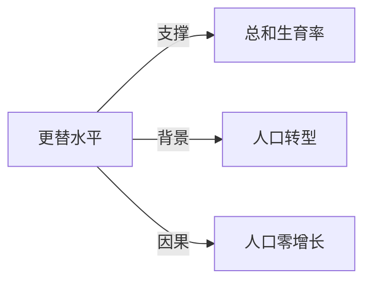

# 更替水平

## 定义
维持人口规模长期稳定所需的总和生育率水平，即每个妇女平均生育的子女数足以替代父母双方。

## 核心解释
更替水平通常指总和生育率约为2.1（发达国家）或更高（高死亡率地区）。它反映人口再生产的临界点：低于此水平，人口将长期缩减；高于此水平，人口趋于增长。关键边界在于它仅考虑生育与死亡，不考虑迁移。常见误解是将其等同于每个妇女生育2个孩子即可，忽略了死亡率和性别人口结构的补充需求。

## 示例
- 许多欧洲国家的总和生育率低于1.5，远低于更替水平，面临人口下降。
- 全球人口增长放缓的部分原因是越来越多国家落入更替水平以下。

## 关联概念
- [[总和生育率]]：更替水平是用总和生育率这一指标来衡量的临界值。
- [[人口转型]]：更替水平常作为人口转型后期生育率下降趋势的参照点。
- [[人口零增长]]：长期保持更替水平可实现人口规模稳定，即零增长。

## 相关问题
- 为什么更替水平不是恰好2.0？
- 不同国家的更替水平有何差异？
- 低于更替水平一定会导致人口立即下降吗？

## 关系图

