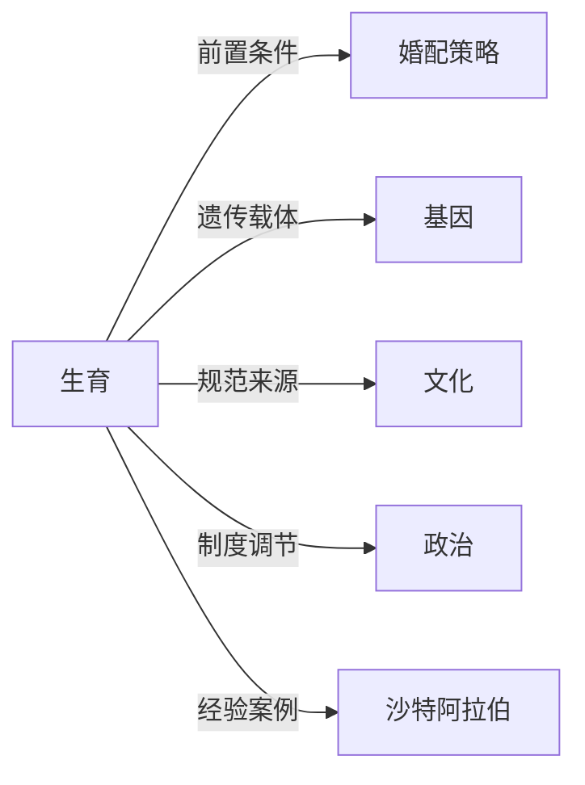

# 生育

## 定义
生育是指生物体产生后代的过程，在人类语境下特指通过生殖实现人口再生产的社会与生物学行为。

## 核心解释
生育兼具自然属性与社会属性。从生物学看，它涉及受孕、妊娠和分娩；从社会学看，它被文化规范、婚配制度、经济激励和政治政策共同塑造。常见的误解是将生育简单等同于生殖本能，忽略了在现代社会中，生育更多是一种经过计算、受到制度调控的选择行为。

## 示例
- 一对夫妻在考虑经济状况和家庭规划后决定生育两个孩子。
- 沙特阿拉伯通过调整公共福利与女性就业政策，间接影响总和生育率的变化。

## 关联概念
- [[婚配策略]]：婚配策略决定了生育的时机、伴侣选择与后代抚养的合作模式。
- [[基因]]：生育是有机体传递基因、实现代际延续的主要途径。
- [[文化]]：文化定义了理想的子女数量、性别偏好以及对生育神圣性或世俗性的认知。
- [[政治]]：政治系统通过生育政策、福利供给和宣传动员对生育率进行干预。
- [[沙特阿拉伯]]：其生育模式在石油经济、宗教传统与现代国家转型的互动中演变，是考察生育行为制度嵌入性的典型样本。

## 相关问题
- 生育率下降的主要社会经济驱动因素有哪些？
- 文化观念如何影响个体的生育意愿与性别偏好？
- 婚配策略的改变如何重塑生育模式？

## 关系图

